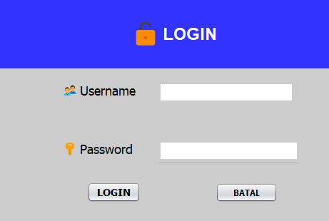
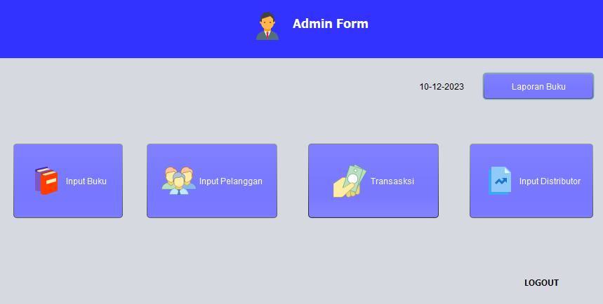
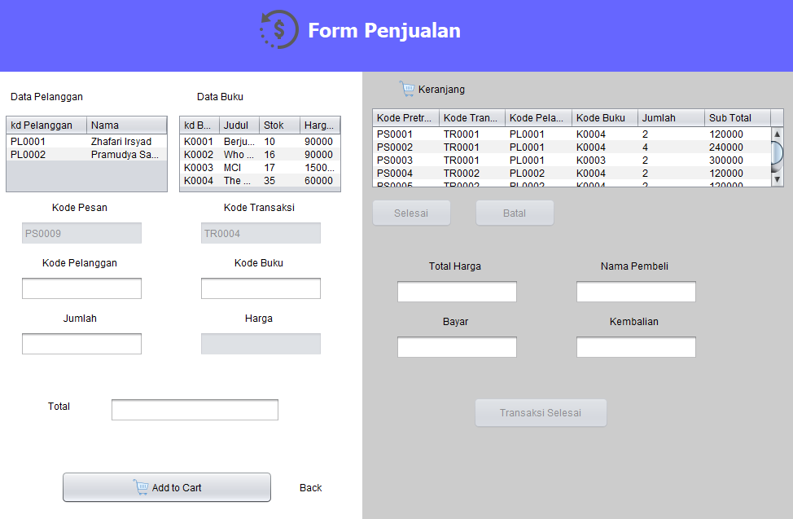
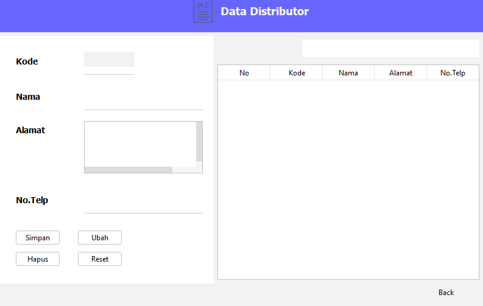

| Nama       | Faris Syahluthfi               |
| ---------- | ------------------------------ |
| NIM        | 312010034                      |
| Kelas      | TI.20.RPL-1                    |
| Mata Kuliah| Desain User Interface            |
| Dosen      | Wahyu Hadikristanto, S.Kom., M.Kom.  |


## Program Penjualan Toko Buku
Membuat aplikasi penjualan toko buku menggunakan bahasa pemrograman Java di Netbeand</br>

# Form Penjualan Toko Buku

# 1. Koneksi Database

``` java

package koneksi;

import java.sql.Connection;
import java.sql.DriverManager;
/**
 *
 * @author Faris
 */
public class config {
    public static Connection conn;
    
    public static Connection Conn(){
        try {
            Class.forName("com.mysql.jdbc.Driver");
            conn = DriverManager.getConnection("jdbc:mysql://localhost/db_javabuku","root","");
        } catch (Exception e) {
            System.out.println(e.getMessage());
        }
        return conn;
    }
    
    public static void main(String args[]){
        System.out.println(config.Conn());
    }
}

```


# 2. Form Login Admin

</p>

Code Program dari form login : </p>

``` java

package views;

import java.sql.Connection;
import java.sql.Statement;
import java.sql.ResultSet;
import java.sql.SQLException;
import javax.swing.*;
import koneksi.config;
/**
 *
 * @author faris
 */
public class login extends javax.swing.JFrame {
    Connection conn;
    public Statement st;
    public ResultSet rs;
    
    
    public void login(){
        try {
            String user = tuser.getText();
            String pass = tpass.getText();
            String sql  = "SELECT * FROM login WHERE username='"+user+"' AND password='"+pass+"'";
            
            conn = config.Conn();
            st   = conn.createStatement();
            rs   = st.executeQuery(sql);
            if (rs.next()) {
                JOptionPane.showMessageDialog(null, "Login Berhasil");
                Form_admin fa = new Form_admin();
                fa.show();
                this.dispose();
            }
            else
            {
                JOptionPane.showMessageDialog(null, "Gagal Login");
            }
        } catch (Exception e) {
            System.out.println(e.getMessage());
        }
    }
  
    public login() {
        initComponents();
        this.setLocationRelativeTo(null);
    }
                       
    private void initComponents() {

        jPanel1 = new javax.swing.JPanel();
        jLabel1 = new javax.swing.JLabel();
        jLabel4 = new javax.swing.JLabel();
        jPanel2 = new javax.swing.JPanel();
        jLabel2 = new javax.swing.JLabel();
        jLabel3 = new javax.swing.JLabel();
        jSeparator1 = new javax.swing.JSeparator();
        tuser = new javax.swing.JTextField();
        jSeparator2 = new javax.swing.JSeparator();
        tpass = new javax.swing.JPasswordField();
        blogin = new javax.swing.JButton();
        jLabel5 = new javax.swing.JLabel();
        jLabel6 = new javax.swing.JLabel();
        jButton1 = new javax.swing.JButton();

        setDefaultCloseOperation(javax.swing.WindowConstants.EXIT_ON_CLOSE);
        getContentPane().setLayout(new org.netbeans.lib.awtextra.AbsoluteLayout());

        jPanel1.setBackground(new java.awt.Color(51, 51, 255));

        jLabel1.setFont(new java.awt.Font("Dialog", 1, 24)); // NOI18N
        jLabel1.setForeground(new java.awt.Color(255, 255, 255));
        jLabel1.setHorizontalAlignment(javax.swing.SwingConstants.CENTER);
        jLabel1.setIcon(new javax.swing.ImageIcon(getClass().getResource("/icon/Padlock_40px.png"))); // NOI18N
        jLabel1.setText("LOGIN");

        javax.swing.GroupLayout jPanel1Layout = new javax.swing.GroupLayout(jPanel1);
        jPanel1.setLayout(jPanel1Layout);
        jPanel1Layout.setHorizontalGroup(
            jPanel1Layout.createParallelGroup(javax.swing.GroupLayout.Alignment.LEADING)
            .addGroup(javax.swing.GroupLayout.Alignment.TRAILING, jPanel1Layout.createSequentialGroup()
                .addContainerGap(174, Short.MAX_VALUE)
                .addComponent(jLabel4)
                .addPreferredGap(javax.swing.LayoutStyle.ComponentPlacement.RELATED)
                .addComponent(jLabel1, javax.swing.GroupLayout.PREFERRED_SIZE, 132, javax.swing.GroupLayout.PREFERRED_SIZE)
                .addGap(158, 158, 158))
        );
        jPanel1Layout.setVerticalGroup(
            jPanel1Layout.createParallelGroup(javax.swing.GroupLayout.Alignment.LEADING)
            .addGroup(jPanel1Layout.createSequentialGroup()
                .addGap(31, 31, 31)
                .addGroup(jPanel1Layout.createParallelGroup(javax.swing.GroupLayout.Alignment.LEADING, false)
                    .addComponent(jLabel1, javax.swing.GroupLayout.DEFAULT_SIZE, javax.swing.GroupLayout.DEFAULT_SIZE, Short.MAX_VALUE)
                    .addComponent(jLabel4, javax.swing.GroupLayout.PREFERRED_SIZE, 39, javax.swing.GroupLayout.PREFERRED_SIZE))
                .addContainerGap(29, Short.MAX_VALUE))
        );

        getContentPane().add(jPanel1, new org.netbeans.lib.awtextra.AbsoluteConstraints(0, 0, 470, 100));

        jPanel2.setBackground(new java.awt.Color(204, 204, 204));

        jLabel2.setBackground(new java.awt.Color(255, 255, 255));
        jLabel2.setFont(new java.awt.Font("Tahoma", 0, 18)); // NOI18N
        jLabel2.setIcon(new javax.swing.ImageIcon(getClass().getResource("/icon/User Account_20px.png"))); // NOI18N
        jLabel2.setText("Username");

        jLabel3.setBackground(new java.awt.Color(255, 255, 255));
        jLabel3.setFont(new java.awt.Font("Tahoma", 0, 18)); // NOI18N
        jLabel3.setIcon(new javax.swing.ImageIcon(getClass().getResource("/icon/Key_20px.png"))); // NOI18N
        jLabel3.setText("Password");

        tuser.setBorder(null);

        tpass.setBorder(null);

        blogin.setFont(new java.awt.Font("Tahoma", 1, 14)); // NOI18N
        blogin.setText("LOGIN");
        blogin.addActionListener(new java.awt.event.ActionListener() {
            public void actionPerformed(java.awt.event.ActionEvent evt) {
                bloginActionPerformed(evt);
            }
        });

        jButton1.setFont(new java.awt.Font("Segoe UI", 1, 12)); // NOI18N
        jButton1.setText("BATAL");
        jButton1.addActionListener(new java.awt.event.ActionListener() {
            public void actionPerformed(java.awt.event.ActionEvent evt) {
                jButton1ActionPerformed(evt);
            }
        });

        javax.swing.GroupLayout jPanel2Layout = new javax.swing.GroupLayout(jPanel2);
        jPanel2.setLayout(jPanel2Layout);
        jPanel2Layout.setHorizontalGroup(
            jPanel2Layout.createParallelGroup(javax.swing.GroupLayout.Alignment.LEADING)
            .addGroup(javax.swing.GroupLayout.Alignment.TRAILING, jPanel2Layout.createSequentialGroup()
                .addContainerGap(72, Short.MAX_VALUE)
                .addGroup(jPanel2Layout.createParallelGroup(javax.swing.GroupLayout.Alignment.LEADING)
                    .addComponent(jLabel5, javax.swing.GroupLayout.Alignment.TRAILING)
                    .addComponent(jLabel6, javax.swing.GroupLayout.Alignment.TRAILING))
                .addGap(18, 18, 18)
                .addGroup(jPanel2Layout.createParallelGroup(javax.swing.GroupLayout.Alignment.LEADING, false)
                    .addGroup(jPanel2Layout.createSequentialGroup()
                        .addGroup(jPanel2Layout.createParallelGroup(javax.swing.GroupLayout.Alignment.LEADING, false)
                            .addComponent(jLabel3, javax.swing.GroupLayout.DEFAULT_SIZE, javax.swing.GroupLayout.DEFAULT_SIZE, Short.MAX_VALUE)
                            .addComponent(jLabel2, javax.swing.GroupLayout.DEFAULT_SIZE, javax.swing.GroupLayout.DEFAULT_SIZE, Short.MAX_VALUE))
                        .addGap(33, 33, 33)
                        .addGroup(jPanel2Layout.createParallelGroup(javax.swing.GroupLayout.Alignment.LEADING, false)
                            .addComponent(jSeparator2)
                            .addGroup(jPanel2Layout.createSequentialGroup()
                                .addComponent(tuser, javax.swing.GroupLayout.PREFERRED_SIZE, 188, javax.swing.GroupLayout.PREFERRED_SIZE)
                                .addPreferredGap(javax.swing.LayoutStyle.ComponentPlacement.RELATED)
                                .addComponent(jSeparator1))
                            .addComponent(tpass, javax.swing.GroupLayout.DEFAULT_SIZE, 195, Short.MAX_VALUE))
                        .addGap(50, 50, 50))
                    .addGroup(jPanel2Layout.createSequentialGroup()
                        .addGap(34, 34, 34)
                        .addComponent(blogin)
                        .addPreferredGap(javax.swing.LayoutStyle.ComponentPlacement.RELATED, javax.swing.GroupLayout.DEFAULT_SIZE, Short.MAX_VALUE)
                        .addComponent(jButton1, javax.swing.GroupLayout.PREFERRED_SIZE, 87, javax.swing.GroupLayout.PREFERRED_SIZE)
                        .addGap(79, 79, 79))))
        );
        jPanel2Layout.setVerticalGroup(
            jPanel2Layout.createParallelGroup(javax.swing.GroupLayout.Alignment.LEADING)
            .addGroup(jPanel2Layout.createSequentialGroup()
                .addContainerGap()
                .addGroup(jPanel2Layout.createParallelGroup(javax.swing.GroupLayout.Alignment.TRAILING)
                    .addGroup(jPanel2Layout.createSequentialGroup()
                        .addGroup(jPanel2Layout.createParallelGroup(javax.swing.GroupLayout.Alignment.TRAILING)
                            .addGroup(jPanel2Layout.createSequentialGroup()
                                .addGroup(jPanel2Layout.createParallelGroup(javax.swing.GroupLayout.Alignment.TRAILING)
                                    .addComponent(jSeparator1, javax.swing.GroupLayout.PREFERRED_SIZE, 10, javax.swing.GroupLayout.PREFERRED_SIZE)
                                    .addGroup(jPanel2Layout.createSequentialGroup()
                                        .addComponent(jLabel6, javax.swing.GroupLayout.PREFERRED_SIZE, 39, javax.swing.GroupLayout.PREFERRED_SIZE)
                                        .addGap(8, 8, 8)))
                                .addGap(37, 37, 37))
                            .addGroup(jPanel2Layout.createSequentialGroup()
                                .addGroup(jPanel2Layout.createParallelGroup(javax.swing.GroupLayout.Alignment.BASELINE)
                                    .addComponent(jLabel2, javax.swing.GroupLayout.PREFERRED_SIZE, 27, javax.swing.GroupLayout.PREFERRED_SIZE)
                                    .addComponent(tuser, javax.swing.GroupLayout.PREFERRED_SIZE, 27, javax.swing.GroupLayout.PREFERRED_SIZE))
                                .addGap(43, 43, 43)))
                        .addComponent(jLabel5, javax.swing.GroupLayout.PREFERRED_SIZE, 39, javax.swing.GroupLayout.PREFERRED_SIZE))
                    .addGroup(jPanel2Layout.createParallelGroup(javax.swing.GroupLayout.Alignment.BASELINE)
                        .addComponent(jLabel3, javax.swing.GroupLayout.PREFERRED_SIZE, 27, javax.swing.GroupLayout.PREFERRED_SIZE)
                        .addComponent(tpass, javax.swing.GroupLayout.PREFERRED_SIZE, 27, javax.swing.GroupLayout.PREFERRED_SIZE)))
                .addGap(2, 2, 2)
                .addComponent(jSeparator2, javax.swing.GroupLayout.PREFERRED_SIZE, 10, javax.swing.GroupLayout.PREFERRED_SIZE)
                .addGap(18, 18, 18)
                .addGroup(jPanel2Layout.createParallelGroup(javax.swing.GroupLayout.Alignment.BASELINE)
                    .addComponent(blogin)
                    .addComponent(jButton1))
                .addContainerGap(47, Short.MAX_VALUE))
        );

        getContentPane().add(jPanel2, new org.netbeans.lib.awtextra.AbsoluteConstraints(0, 100, 470, 230));

        pack();
    }

    private void bloginActionPerformed(java.awt.event.ActionEvent evt) {                                       
        login();
    }                                      

    private void jButton1ActionPerformed(java.awt.event.ActionEvent evt) {                                         
        this.dispose();
    }                                        

    
    public static void main(String args[]) {
        try {
            for (javax.swing.UIManager.LookAndFeelInfo info : javax.swing.UIManager.getInstalledLookAndFeels()) {
                if ("Nimbus".equals(info.getName())) {
                    javax.swing.UIManager.setLookAndFeel(info.getClassName());
                    break;
                }
            }
        } catch (ClassNotFoundException ex) {
            java.util.logging.Logger.getLogger(login.class.getName()).log(java.util.logging.Level.SEVERE, null, ex);
        } catch (InstantiationException ex) {
            java.util.logging.Logger.getLogger(login.class.getName()).log(java.util.logging.Level.SEVERE, null, ex);
        } catch (IllegalAccessException ex) {
            java.util.logging.Logger.getLogger(login.class.getName()).log(java.util.logging.Level.SEVERE, null, ex);
        } catch (javax.swing.UnsupportedLookAndFeelException ex) {
            java.util.logging.Logger.getLogger(login.class.getName()).log(java.util.logging.Level.SEVERE, null, ex);
        }
      
        java.awt.EventQueue.invokeLater(new Runnable() {
            public void run() {
                new login().setVisible(true);
            }
        });
    }

                       
    private javax.swing.JButton blogin;
    private javax.swing.JButton jButton1;
    private javax.swing.JLabel jLabel1;
    private javax.swing.JLabel jLabel2;
    private javax.swing.JLabel jLabel3;
    private javax.swing.JLabel jLabel4;
    private javax.swing.JLabel jLabel5;
    private javax.swing.JLabel jLabel6;
    private javax.swing.JPanel jPanel1;
    private javax.swing.JPanel jPanel2;
    private javax.swing.JSeparator jSeparator1;
    private javax.swing.JSeparator jSeparator2;
    private javax.swing.JPasswordField tpass;
    private javax.swing.JTextField tuser;
                     
}

```

# 3. Form Menu Utama

</p>

Code Program dari form menu utama : </p>

``` java

package views;

import java.sql.Connection;
import java.sql.ResultSet;
import java.sql.Statement;
import java.util.HashMap;
import javax.swing.JOptionPane;
import java.util.*;
import javax.swing.table.DefaultTableModel;

 * @author Faris
 */
public class Form_admin extends javax.swing.JFrame {
    public Statement st;
    public ResultSet rs;
    public DefaultTableModel tabmodel;
    
    Connection conn = koneksi.config.Conn();
    
    public Form_admin() {
        initComponents();

        new Thread(){
            public void run(){
                while (true) {                    
                    Calendar kal = new GregorianCalendar();
                    int tahun = kal.get(Calendar.YEAR);
                    int bulan = kal.get(Calendar.MONTH)+1;
                    int hari  = kal.get(Calendar.DAY_OF_MONTH);
                    
                    String tanggal = hari + "-" + bulan + "-" + tahun;
                    
                    jLabel4.setText(tanggal);
                }
            }
        }.start();
    }

                             
    private void initComponents() {

        jPanel1 = new javax.swing.JPanel();
        jLabel1 = new javax.swing.JLabel();
        jLabel2 = new javax.swing.JLabel();
        bbuku = new javax.swing.JButton();
        bpelanggan = new javax.swing.JButton();
        btrans = new javax.swing.JButton();
        jLabel3 = new javax.swing.JLabel();
        bdis = new javax.swing.JButton();
        laporan = new javax.swing.JButton();
        jLabel4 = new javax.swing.JLabel();

        setDefaultCloseOperation(javax.swing.WindowConstants.EXIT_ON_CLOSE);
        getContentPane().setLayout(new org.netbeans.lib.awtextra.AbsoluteLayout());

        jPanel1.setBackground(new java.awt.Color(51, 51, 255));
        jPanel1.setLayout(new org.netbeans.lib.awtextra.AbsoluteLayout());

        jLabel1.setFont(new java.awt.Font("Tahoma", 1, 18)); // NOI18N
        jLabel1.setForeground(new java.awt.Color(255, 255, 255));
        jLabel1.setText("Admin Form");
        jPanel1.add(jLabel1, new org.netbeans.lib.awtextra.AbsoluteConstraints(420, 20, 110, 40));

        jLabel2.setIcon(new javax.swing.ImageIcon(getClass().getResource("/icon/icons8_Businessman_48px.png"))); // NOI18N
        jPanel1.add(jLabel2, new org.netbeans.lib.awtextra.AbsoluteConstraints(360, 20, -1, -1));

        getContentPane().add(jPanel1, new org.netbeans.lib.awtextra.AbsoluteConstraints(0, 0, 900, 90));

        bbuku.setBackground(new java.awt.Color(102, 102, 255));
        bbuku.setForeground(new java.awt.Color(255, 255, 255));
        bbuku.setIcon(new javax.swing.ImageIcon(getClass().getResource("/icon/icons8_Books_48px_1.png"))); // NOI18N
        bbuku.setText("Input Buku");
        bbuku.addActionListener(new java.awt.event.ActionListener() {
            public void actionPerformed(java.awt.event.ActionEvent evt) {
                bbukuActionPerformed(evt);
            }
        });
        getContentPane().add(bbuku, new org.netbeans.lib.awtextra.AbsoluteConstraints(20, 210, 160, 110));

        bpelanggan.setBackground(new java.awt.Color(102, 102, 255));
        bpelanggan.setForeground(new java.awt.Color(255, 255, 255));
        bpelanggan.setIcon(new javax.swing.ImageIcon(getClass().getResource("/icon/icons8_People_50px.png"))); // NOI18N
        bpelanggan.setText("Input Pelanggan");
        bpelanggan.addActionListener(new java.awt.event.ActionListener() {
            public void actionPerformed(java.awt.event.ActionEvent evt) {
                bpelangganActionPerformed(evt);
            }
        });
        getContentPane().add(bpelanggan, new org.netbeans.lib.awtextra.AbsoluteConstraints(210, 210, 190, 110));

        btrans.setBackground(new java.awt.Color(102, 102, 255));
        btrans.setForeground(new java.awt.Color(255, 255, 255));
        btrans.setIcon(new javax.swing.ImageIcon(getClass().getResource("/icon/icons8_Cash_in_Hand_50px.png"))); // NOI18N
        btrans.setText("Transasksi");
        btrans.addActionListener(new java.awt.event.ActionListener() {
            public void actionPerformed(java.awt.event.ActionEvent evt) {
                btransActionPerformed(evt);
            }
        });
        getContentPane().add(btrans, new org.netbeans.lib.awtextra.AbsoluteConstraints(440, 210, 190, 110));

        jLabel3.setFont(new java.awt.Font("Segoe UI", 1, 12)); // NOI18N
        jLabel3.setText("LOGOUT");
        jLabel3.addMouseListener(new java.awt.event.MouseAdapter() {
            public void mouseClicked(java.awt.event.MouseEvent evt) {
                jLabel3MouseClicked(evt);
            }
        });
        getContentPane().add(jLabel3, new org.netbeans.lib.awtextra.AbsoluteConstraints(750, 390, 100, 40));

        bdis.setBackground(new java.awt.Color(102, 102, 255));
        bdis.setForeground(new java.awt.Color(255, 255, 255));
        bdis.setIcon(new javax.swing.ImageIcon(getClass().getResource("/icon/Ratings_50px.png"))); // NOI18N
        bdis.setText("Input Distributor");
        bdis.addActionListener(new java.awt.event.ActionListener() {
            public void actionPerformed(java.awt.event.ActionEvent evt) {
                bdisActionPerformed(evt);
            }
        });
        getContentPane().add(bdis, new org.netbeans.lib.awtextra.AbsoluteConstraints(670, 210, 180, 110));

        laporan.setBackground(new java.awt.Color(102, 102, 255));
        laporan.setForeground(new java.awt.Color(255, 255, 255));
        laporan.setText("Laporan Buku");
        laporan.addActionListener(new java.awt.event.ActionListener() {
            public void actionPerformed(java.awt.event.ActionEvent evt) {
                laporanActionPerformed(evt);
            }
        });
        getContentPane().add(laporan, new org.netbeans.lib.awtextra.AbsoluteConstraints(690, 110, 160, 40));

        jLabel4.setOpaque(true);
        getContentPane().add(jLabel4, new org.netbeans.lib.awtextra.AbsoluteConstraints(600, 120, 70, 20));

        setSize(new java.awt.Dimension(888, 490));
        setLocationRelativeTo(null);
    }// </editor-fold>                        

    private void jLabel3MouseClicked(java.awt.event.MouseEvent evt) {                                     
        int a = JOptionPane.showConfirmDialog(null, "Yakin ingin logout?", "Informasi", JOptionPane.YES_NO_OPTION);
        if (a == JOptionPane.YES_OPTION) {
            login l = new login();
            l.show();
            this.dispose();
        }       
    }                                    

    private void bdisActionPerformed(java.awt.event.ActionEvent evt) {                                     
        D_distributor dd = new D_distributor();
        dd.show();
        this.dispose();
    }                                    

    private void bbukuActionPerformed(java.awt.event.ActionEvent evt) {                                      
        D_buku db = new D_buku();
        db.show();
        this.dispose();
    }                                     

    private void bpelangganActionPerformed(java.awt.event.ActionEvent evt) {                                           
        D_pelanggan dp = new D_pelanggan();
        dp.show();
        this.dispose();
    }                                          

    private void btransActionPerformed(java.awt.event.ActionEvent evt) {                                       
        form_beli fb = new form_beli();
        fb.show();
        this.dispose();
    }                                      
    public void t_report(){
            String reportSource = null;
            String reportDest = null;
        

    }
    private void laporanActionPerformed(java.awt.event.ActionEvent evt) {                                        
        try {
            t_report();
        } catch (Exception e) {
            System.out.println(e.getMessage());
        }
    }                                       

    public static void main(String args[]) {
        try {
            for (javax.swing.UIManager.LookAndFeelInfo info : javax.swing.UIManager.getInstalledLookAndFeels()) {
                if ("Nimbus".equals(info.getName())) {
                    javax.swing.UIManager.setLookAndFeel(info.getClassName());
                    break;
                }
            }
        } catch (ClassNotFoundException ex) {
            java.util.logging.Logger.getLogger(Form_admin.class.getName()).log(java.util.logging.Level.SEVERE, null, ex);
        } catch (InstantiationException ex) {
            java.util.logging.Logger.getLogger(Form_admin.class.getName()).log(java.util.logging.Level.SEVERE, null, ex);
        } catch (IllegalAccessException ex) {
            java.util.logging.Logger.getLogger(Form_admin.class.getName()).log(java.util.logging.Level.SEVERE, null, ex);
        } catch (javax.swing.UnsupportedLookAndFeelException ex) {
            java.util.logging.Logger.getLogger(Form_admin.class.getName()).log(java.util.logging.Level.SEVERE, null, ex);
        }
       
        java.awt.EventQueue.invokeLater(new Runnable() {
            public void run() {
                new Form_admin().setVisible(true);
            }
        });
    }
                 
    private javax.swing.JButton bbuku;
    private javax.swing.JButton bdis;
    private javax.swing.JButton bpelanggan;
    private javax.swing.JButton btrans;
    private javax.swing.JLabel jLabel1;
    private javax.swing.JLabel jLabel2;
    private javax.swing.JLabel jLabel3;
    private javax.swing.JLabel jLabel4;
    private javax.swing.JPanel jPanel1;
    private javax.swing.JButton laporan;
                    
}

``` 

# 4. Form Data Buku

</p>

Code Program dari form menu utama : </p>

``` java

package views;

import java.awt.event.KeyEvent;
import javax.swing.JInternalFrame;
import java.sql.Connection;
import java.sql.Statement;
import java.sql.ResultSet;
import java.sql.SQLException;
import javax.swing.*;
import javax.swing.table.*;
import koneksi.config;
import java.util.logging.*;
import static koneksi.config.conn;
/**
 *
 * @author Faris
 */
public class D_buku extends javax.swing.JFrame {
    public Statement st;
    public ResultSet rs;
    public DefaultTableModel tabmodel;
    
    Connection conn = koneksi.config.Conn();
    /**
     * Creates new form D_buku
     */
    public D_buku() {
        initComponents();
        this.setLocationRelativeTo(null);
        update.setEnabled(false);
        hapus.setEnabled(false);
        judul();
        AutoKode();
        tampil();
//        reset();
    }

    /**
     * This method is called from within the constructor to initialize the form.
     * WARNING: Do NOT modify this code. The content of this method is always
     * regenerated by the Form Editor.
     */
    @SuppressWarnings("unchecked")
    // <editor-fold defaultstate="collapsed" desc="Generated Code">                          
    private void initComponents() {

        jPanel1 = new javax.swing.JPanel();
        jLabel1 = new javax.swing.JLabel();
        jLabel2 = new javax.swing.JLabel();
        jScrollPane1 = new javax.swing.JScrollPane();
        tbuku = new javax.swing.JTable();
        tcari = new javax.swing.JTextField();
        jLabel3 = new javax.swing.JLabel();
        jLabel4 = new javax.swing.JLabel();
        jLabel5 = new javax.swing.JLabel();
        jLabel6 = new javax.swing.JLabel();
        jLabel7 = new javax.swing.JLabel();
        jLabel8 = new javax.swing.JLabel();
        jLabel9 = new javax.swing.JLabel();
        tkd_buku = new javax.swing.JTextField();
        tjudul = new javax.swing.JTextField();
        tpenulis = new javax.swing.JTextField();
        tpenerbit = new javax.swing.JTextField();
        jtahun = new javax.swing.JTextField();
        th_pokok = new javax.swing.JTextField();
        th_jual = new javax.swing.JTextField();
        jLabel11 = new javax.swing.JLabel();
        hapus = new javax.swing.JButton();
        reset = new javax.swing.JButton();
        update = new javax.swing.JButton();
        tambah = new javax.swing.JButton();
        jLabel14 = new javax.swing.JLabel();
        jenis = new javax.swing.JComboBox();
        jLabel10 = new javax.swing.JLabel();
        stok = new javax.swing.JTextField();
        jLabel13 = new javax.swing.JLabel();

        setDefaultCloseOperation(javax.swing.WindowConstants.EXIT_ON_CLOSE);

        jPanel1.setBackground(new java.awt.Color(102, 102, 255));

        jLabel1.setFont(new java.awt.Font("Tahoma", 1, 18)); // NOI18N
        jLabel1.setForeground(new java.awt.Color(255, 255, 255));
        jLabel1.setHorizontalAlignment(javax.swing.SwingConstants.CENTER);
        jLabel1.setIcon(new javax.swing.ImageIcon(getClass().getResource("/icon/icons8_Books_48px_1.png"))); // NOI18N
        jLabel1.setText("Data Buku");

        javax.swing.GroupLayout jPanel1Layout = new javax.swing.GroupLayout(jPanel1);
        jPanel1.setLayout(jPanel1Layout);
        jPanel1Layout.setHorizontalGroup(
            jPanel1Layout.createParallelGroup(javax.swing.GroupLayout.Alignment.LEADING)
            .addGroup(javax.swing.GroupLayout.Alignment.TRAILING, jPanel1Layout.createSequentialGroup()
                .addContainerGap(350, Short.MAX_VALUE)
                .addComponent(jLabel2)
                .addPreferredGap(javax.swing.LayoutStyle.ComponentPlacement.RELATED)
                .addComponent(jLabel1, javax.swing.GroupLayout.PREFERRED_SIZE, 166, javax.swing.GroupLayout.PREFERRED_SIZE)
                .addGap(395, 395, 395))
        );
        jPanel1Layout.setVerticalGroup(
            jPanel1Layout.createParallelGroup(javax.swing.GroupLayout.Alignment.LEADING)
            .addGroup(jPanel1Layout.createSequentialGroup()
                .addContainerGap()
                .addGroup(jPanel1Layout.createParallelGroup(javax.swing.GroupLayout.Alignment.TRAILING, false)
                    .addGroup(jPanel1Layout.createSequentialGroup()
                        .addComponent(jLabel2, javax.swing.GroupLayout.DEFAULT_SIZE, javax.swing.GroupLayout.DEFAULT_SIZE, Short.MAX_VALUE)
                        .addGap(3, 3, 3))
                    .addComponent(jLabel1, javax.swing.GroupLayout.Alignment.LEADING, javax.swing.GroupLayout.PREFERRED_SIZE, 39, javax.swing.GroupLayout.PREFERRED_SIZE))
                .addContainerGap(15, Short.MAX_VALUE))
        );

        tbuku.setModel(new javax.swing.table.DefaultTableModel(
            new Object [][] {

            },
            new String [] {
                "No", "Kode Buku", "Judul", "Jenis", "Penulis", "Penerbit", "Tahun", "Stok", "Harga Pokok", "Harga Jual"
            }
        ));
        tbuku.addMouseListener(new java.awt.event.MouseAdapter() {
            public void mouseClicked(java.awt.event.MouseEvent evt) {
                tbukuMouseClicked(evt);
            }
        });
        jScrollPane1.setViewportView(tbuku);

        tcari.setBorder(null);
        tcari.addActionListener(new java.awt.event.ActionListener() {
            public void actionPerformed(java.awt.event.ActionEvent evt) {
                tcariActionPerformed(evt);
            }
        });
        tcari.addKeyListener(new java.awt.event.KeyAdapter() {
            public void keyReleased(java.awt.event.KeyEvent evt) {
                tcariKeyReleased(evt);
            }
        });

        jLabel3.setText("Judul");

        jLabel4.setText("Kode Buku");

        jLabel5.setText("Penerbit");

        jLabel6.setText("Penulis");

        jLabel7.setText("Tahun");

        jLabel8.setText("Harga Pokok");

        jLabel9.setText("Harga Jual");

        jtahun.addKeyListener(new java.awt.event.KeyAdapter() {
            public void keyTyped(java.awt.event.KeyEvent evt) {
                jtahunKeyTyped(evt);
            }
        });

        jLabel11.setText("Back");
        jLabel11.addMouseListener(new java.awt.event.MouseAdapter() {
            public void mouseClicked(java.awt.event.MouseEvent evt) {
                jLabel11MouseClicked(evt);
            }
        });

        hapus.setText("Hapus");
        hapus.addActionListener(new java.awt.event.ActionListener() {
            public void actionPerformed(java.awt.event.ActionEvent evt) {
                hapusActionPerformed(evt);
            }
        });

        reset.setText("Reset");
        reset.addActionListener(new java.awt.event.ActionListener() {
            public void actionPerformed(java.awt.event.ActionEvent evt) {
                resetActionPerformed(evt);
            }
        });

        update.setText("Update");
        update.addActionListener(new java.awt.event.ActionListener() {
            public void actionPerformed(java.awt.event.ActionEvent evt) {
                updateActionPerformed(evt);
            }
        });

        tambah.setText("Tambah");
        tambah.addActionListener(new java.awt.event.ActionListener() {
            public void actionPerformed(java.awt.event.ActionEvent evt) {
                tambahActionPerformed(evt);
            }
        });

        jLabel14.setText("Jenis");

        jenis.setModel(new javax.swing.DefaultComboBoxModel(new String[] { "Novel", "Sejarah", "Edukasi", "Tutorial" }));

        jLabel10.setText("Stok");

        stok.addKeyListener(new java.awt.event.KeyAdapter() {
            public void keyTyped(java.awt.event.KeyEvent evt) {
                stokKeyTyped(evt);
            }
        });

        javax.swing.GroupLayout layout = new javax.swing.GroupLayout(getContentPane());
        getContentPane().setLayout(layout);
        layout.setHorizontalGroup(
            layout.createParallelGroup(javax.swing.GroupLayout.Alignment.LEADING)
            .addComponent(jPanel1, javax.swing.GroupLayout.DEFAULT_SIZE, javax.swing.GroupLayout.DEFAULT_SIZE, Short.MAX_VALUE)
            .addGroup(layout.createSequentialGroup()
                .addGroup(layout.createParallelGroup(javax.swing.GroupLayout.Alignment.LEADING)
                    .addGroup(layout.createSequentialGroup()
                        .addGap(8, 8, 8)
                        .addComponent(jLabel13, javax.swing.GroupLayout.PREFERRED_SIZE, 40, javax.swing.GroupLayout.PREFERRED_SIZE)
                        .addPreferredGap(javax.swing.LayoutStyle.ComponentPlacement.UNRELATED)
                        .addComponent(tcari, javax.swing.GroupLayout.PREFERRED_SIZE, 260, javax.swing.GroupLayout.PREFERRED_SIZE)
                        .addGap(18, 18, Short.MAX_VALUE))
                    .addGroup(javax.swing.GroupLayout.Alignment.TRAILING, layout.createSequentialGroup()
                        .addContainerGap()
                        .addComponent(jScrollPane1)
                        .addPreferredGap(javax.swing.LayoutStyle.ComponentPlacement.UNRELATED)))
                .addGroup(layout.createParallelGroup(javax.swing.GroupLayout.Alignment.LEADING)
                    .addGroup(javax.swing.GroupLayout.Alignment.TRAILING, layout.createSequentialGroup()
                        .addGroup(layout.createParallelGroup(javax.swing.GroupLayout.Alignment.LEADING, false)
                            .addGroup(layout.createSequentialGroup()
                                .addComponent(jLabel4, javax.swing.GroupLayout.PREFERRED_SIZE, 71, javax.swing.GroupLayout.PREFERRED_SIZE)
                                .addGap(18, 18, 18)
                                .addComponent(tkd_buku, javax.swing.GroupLayout.PREFERRED_SIZE, 124, javax.swing.GroupLayout.PREFERRED_SIZE))
                            .addGroup(layout.createSequentialGroup()
                                .addComponent(jLabel8, javax.swing.GroupLayout.PREFERRED_SIZE, 71, javax.swing.GroupLayout.PREFERRED_SIZE)
                                .addGap(18, 18, 18)
                                .addComponent(th_pokok, javax.swing.GroupLayout.PREFERRED_SIZE, 124, javax.swing.GroupLayout.PREFERRED_SIZE))
                            .addGroup(layout.createSequentialGroup()
                                .addComponent(jLabel9, javax.swing.GroupLayout.PREFERRED_SIZE, 71, javax.swing.GroupLayout.PREFERRED_SIZE)
                                .addGap(18, 18, 18)
                                .addComponent(th_jual, javax.swing.GroupLayout.PREFERRED_SIZE, 124, javax.swing.GroupLayout.PREFERRED_SIZE))
                            .addGroup(layout.createSequentialGroup()
                                .addComponent(jLabel5, javax.swing.GroupLayout.PREFERRED_SIZE, 71, javax.swing.GroupLayout.PREFERRED_SIZE)
                                .addGap(18, 18, 18)
                                .addComponent(tpenerbit, javax.swing.GroupLayout.PREFERRED_SIZE, 124, javax.swing.GroupLayout.PREFERRED_SIZE))
                            .addGroup(layout.createSequentialGroup()
                                .addComponent(jLabel7, javax.swing.GroupLayout.PREFERRED_SIZE, 71, javax.swing.GroupLayout.PREFERRED_SIZE)
                                .addGap(18, 18, 18)
                                .addComponent(jtahun, javax.swing.GroupLayout.PREFERRED_SIZE, 124, javax.swing.GroupLayout.PREFERRED_SIZE))
                            .addGroup(layout.createSequentialGroup()
                                .addComponent(jLabel6, javax.swing.GroupLayout.PREFERRED_SIZE, 71, javax.swing.GroupLayout.PREFERRED_SIZE)
                                .addGap(18, 18, 18)
                                .addComponent(tpenulis, javax.swing.GroupLayout.PREFERRED_SIZE, 124, javax.swing.GroupLayout.PREFERRED_SIZE))
                            .addGroup(layout.createSequentialGroup()
                                .addComponent(jLabel3, javax.swing.GroupLayout.PREFERRED_SIZE, 71, javax.swing.GroupLayout.PREFERRED_SIZE)
                                .addGap(18, 18, 18)
                                .addComponent(tjudul, javax.swing.GroupLayout.PREFERRED_SIZE, 124, javax.swing.GroupLayout.PREFERRED_SIZE))
                            .addGroup(layout.createSequentialGroup()
                                .addGroup(layout.createParallelGroup(javax.swing.GroupLayout.Alignment.LEADING, false)
                                    .addComponent(tambah, javax.swing.GroupLayout.DEFAULT_SIZE, javax.swing.GroupLayout.DEFAULT_SIZE, Short.MAX_VALUE)
                                    .addComponent(hapus, javax.swing.GroupLayout.PREFERRED_SIZE, 71, javax.swing.GroupLayout.PREFERRED_SIZE))
                                .addGap(28, 28, 28)
                                .addGroup(layout.createParallelGroup(javax.swing.GroupLayout.Alignment.LEADING, false)
                                    .addComponent(reset, javax.swing.GroupLayout.PREFERRED_SIZE, 71, javax.swing.GroupLayout.PREFERRED_SIZE)
                                    .addComponent(update, javax.swing.GroupLayout.PREFERRED_SIZE, 71, javax.swing.GroupLayout.PREFERRED_SIZE)))
                            .addGroup(layout.createSequentialGroup()
                                .addComponent(jLabel14, javax.swing.GroupLayout.PREFERRED_SIZE, 71, javax.swing.GroupLayout.PREFERRED_SIZE)
                                .addGap(18, 18, 18)
                                .addComponent(jenis, 0, javax.swing.GroupLayout.DEFAULT_SIZE, Short.MAX_VALUE)))
                        .addGap(39, 39, 39))
                    .addComponent(jLabel11, javax.swing.GroupLayout.Alignment.TRAILING, javax.swing.GroupLayout.PREFERRED_SIZE, 67, javax.swing.GroupLayout.PREFERRED_SIZE)
                    .addGroup(layout.createSequentialGroup()
                        .addComponent(jLabel10, javax.swing.GroupLayout.PREFERRED_SIZE, 71, javax.swing.GroupLayout.PREFERRED_SIZE)
                        .addGap(18, 18, 18)
                        .addComponent(stok, javax.swing.GroupLayout.PREFERRED_SIZE, 124, javax.swing.GroupLayout.PREFERRED_SIZE)
                        .addContainerGap())))
        );
        layout.setVerticalGroup(
            layout.createParallelGroup(javax.swing.GroupLayout.Alignment.LEADING)
            .addGroup(layout.createSequentialGroup()
                .addComponent(jPanel1, javax.swing.GroupLayout.PREFERRED_SIZE, javax.swing.GroupLayout.DEFAULT_SIZE, javax.swing.GroupLayout.PREFERRED_SIZE)
                .addGroup(layout.createParallelGroup(javax.swing.GroupLayout.Alignment.LEADING)
                    .addGroup(layout.createSequentialGroup()
                        .addGap(18, 18, 18)
                        .addComponent(tcari, javax.swing.GroupLayout.PREFERRED_SIZE, 29, javax.swing.GroupLayout.PREFERRED_SIZE))
                    .addGroup(layout.createSequentialGroup()
                        .addGap(8, 8, 8)
                        .addComponent(jLabel11))
                    .addGroup(layout.createSequentialGroup()
                        .addGap(18, 18, 18)
                        .addComponent(jLabel13)))
                .addPreferredGap(javax.swing.LayoutStyle.ComponentPlacement.UNRELATED)
                .addGroup(layout.createParallelGroup(javax.swing.GroupLayout.Alignment.LEADING)
                    .addGroup(layout.createSequentialGroup()
                        .addGroup(layout.createParallelGroup(javax.swing.GroupLayout.Alignment.BASELINE)
                            .addComponent(jLabel4, javax.swing.GroupLayout.PREFERRED_SIZE, 29, javax.swing.GroupLayout.PREFERRED_SIZE)
                            .addComponent(tkd_buku, javax.swing.GroupLayout.PREFERRED_SIZE, javax.swing.GroupLayout.DEFAULT_SIZE, javax.swing.GroupLayout.PREFERRED_SIZE))
                        .addGap(6, 6, 6)
                        .addGroup(layout.createParallelGroup(javax.swing.GroupLayout.Alignment.BASELINE)
                            .addComponent(jLabel3, javax.swing.GroupLayout.PREFERRED_SIZE, 29, javax.swing.GroupLayout.PREFERRED_SIZE)
                            .addComponent(tjudul, javax.swing.GroupLayout.PREFERRED_SIZE, javax.swing.GroupLayout.DEFAULT_SIZE, javax.swing.GroupLayout.PREFERRED_SIZE))
                        .addPreferredGap(javax.swing.LayoutStyle.ComponentPlacement.RELATED, 27, Short.MAX_VALUE)
                        .addGroup(layout.createParallelGroup(javax.swing.GroupLayout.Alignment.BASELINE)
                            .addComponent(jLabel14, javax.swing.GroupLayout.PREFERRED_SIZE, 29, javax.swing.GroupLayout.PREFERRED_SIZE)
                            .addComponent(jenis, javax.swing.GroupLayout.PREFERRED_SIZE, javax.swing.GroupLayout.DEFAULT_SIZE, javax.swing.GroupLayout.PREFERRED_SIZE))
                        .addPreferredGap(javax.swing.LayoutStyle.ComponentPlacement.RELATED)
                        .addGroup(layout.createParallelGroup(javax.swing.GroupLayout.Alignment.BASELINE)
                            .addComponent(jLabel6, javax.swing.GroupLayout.PREFERRED_SIZE, 29, javax.swing.GroupLayout.PREFERRED_SIZE)
                            .addComponent(tpenulis, javax.swing.GroupLayout.PREFERRED_SIZE, javax.swing.GroupLayout.DEFAULT_SIZE, javax.swing.GroupLayout.PREFERRED_SIZE))
                        .addPreferredGap(javax.swing.LayoutStyle.ComponentPlacement.UNRELATED)
                        .addGroup(layout.createParallelGroup(javax.swing.GroupLayout.Alignment.BASELINE)
                            .addComponent(jLabel5, javax.swing.GroupLayout.PREFERRED_SIZE, 29, javax.swing.GroupLayout.PREFERRED_SIZE)
                            .addComponent(tpenerbit, javax.swing.GroupLayout.PREFERRED_SIZE, javax.swing.GroupLayout.DEFAULT_SIZE, javax.swing.GroupLayout.PREFERRED_SIZE))
                        .addPreferredGap(javax.swing.LayoutStyle.ComponentPlacement.UNRELATED)
                        .addGroup(layout.createParallelGroup(javax.swing.GroupLayout.Alignment.BASELINE)
                            .addComponent(jLabel7, javax.swing.GroupLayout.PREFERRED_SIZE, 29, javax.swing.GroupLayout.PREFERRED_SIZE)
                            .addComponent(jtahun, javax.swing.GroupLayout.PREFERRED_SIZE, javax.swing.GroupLayout.DEFAULT_SIZE, javax.swing.GroupLayout.PREFERRED_SIZE))
                        .addPreferredGap(javax.swing.LayoutStyle.ComponentPlacement.RELATED)
                        .addGroup(layout.createParallelGroup(javax.swing.GroupLayout.Alignment.BASELINE)
                            .addComponent(jLabel10, javax.swing.GroupLayout.PREFERRED_SIZE, 29, javax.swing.GroupLayout.PREFERRED_SIZE)
                            .addComponent(stok, javax.swing.GroupLayout.PREFERRED_SIZE, javax.swing.GroupLayout.DEFAULT_SIZE, javax.swing.GroupLayout.PREFERRED_SIZE))
                        .addPreferredGap(javax.swing.LayoutStyle.ComponentPlacement.RELATED, javax.swing.GroupLayout.DEFAULT_SIZE, Short.MAX_VALUE)
                        .addGroup(layout.createParallelGroup(javax.swing.GroupLayout.Alignment.BASELINE)
                            .addComponent(jLabel8, javax.swing.GroupLayout.PREFERRED_SIZE, 29, javax.swing.GroupLayout.PREFERRED_SIZE)
                            .addComponent(th_pokok, javax.swing.GroupLayout.PREFERRED_SIZE, javax.swing.GroupLayout.DEFAULT_SIZE, javax.swing.GroupLayout.PREFERRED_SIZE))
                        .addPreferredGap(javax.swing.LayoutStyle.ComponentPlacement.RELATED)
                        .addGroup(layout.createParallelGroup(javax.swing.GroupLayout.Alignment.BASELINE)
                            .addComponent(jLabel9, javax.swing.GroupLayout.PREFERRED_SIZE, 29, javax.swing.GroupLayout.PREFERRED_SIZE)
                            .addComponent(th_jual, javax.swing.GroupLayout.PREFERRED_SIZE, javax.swing.GroupLayout.DEFAULT_SIZE, javax.swing.GroupLayout.PREFERRED_SIZE))
                        .addPreferredGap(javax.swing.LayoutStyle.ComponentPlacement.RELATED)
                        .addGroup(layout.createParallelGroup(javax.swing.GroupLayout.Alignment.BASELINE)
                            .addComponent(reset)
                            .addComponent(tambah))
                        .addPreferredGap(javax.swing.LayoutStyle.ComponentPlacement.UNRELATED)
                        .addGroup(layout.createParallelGroup(javax.swing.GroupLayout.Alignment.BASELINE)
                            .addComponent(update)
                            .addComponent(hapus)))
                    .addGroup(layout.createSequentialGroup()
                        .addComponent(jScrollPane1, javax.swing.GroupLayout.PREFERRED_SIZE, 416, javax.swing.GroupLayout.PREFERRED_SIZE)
                        .addGap(0, 8, Short.MAX_VALUE)))
                .addContainerGap())
        );

        setSize(new java.awt.Dimension(933, 593));
        setLocationRelativeTo(null);
    }// </editor-fold>                        

    public void judul(){
        Object[] judul = {"Id Buku","Judul","Jenis","Penulis","Penerbit","Tahun","Stok","HargaPokok","HargaJual"};
        tabmodel = new DefaultTableModel(null,judul){
            public boolean isCellEditable(int row, int column) {
                return false;
            }
        };
        tbuku.setModel(tabmodel);
    }
    public void AutoKode(){
           try{
                rs = conn.createStatement().executeQuery("SELECT * FROM buku ORDER BY kd_buku DESC");
                if(rs.next()){
                    String kode = rs.getString("kd_buku").substring(3);
                     String AN = "" + (Integer.parseInt(kode) + 1);
                     String Nol = "";
                    
                    if(AN.length() == 1){
                      Nol = "000";
                    }
                    else if(AN.length() == 2){
                        Nol = "00";
                    }
                    else if(AN.length() == 3){
                         Nol = "0";
                    }
                    else if(AN.length() == 4){
                        Nol = "";
                    }
                    tkd_buku.setText("K" + Nol + AN);
             
                }
                else{
                    tkd_buku.setText("K0001");
                }
                tkd_buku.enable(false);
                rs.close();
                
           }
           catch (Exception e) {
                JOptionPane.showMessageDialog(this,e.getMessage());
            }
           
            
        }
    
    public void tampil(){
        try {
            st = conn.createStatement();
            tabmodel.getDataVector().removeAllElements();
            tabmodel.fireTableDataChanged();
            rs = st.executeQuery("SELECT * FROM buku");
            while (rs.next()) {                
                Object[] data = {
                    rs.getString("kd_buku"),
                    rs.getString("judul"),
                    rs.getString("jenis"),
                    rs.getString("penulis"),
                    rs.getString("penerbit"),
                    rs.getString("tahun"),
                    rs.getString("stok"),
                    rs.getString("harga_pokok"),
                    rs.getString("harga_jual"),
                };
                tabmodel.addRow(data);
            }
        } catch (Exception e) {
            e.printStackTrace();
        }
    }
    
    public void reset(){
        tkd_buku.setText("");
        tjudul.setText("");
        tpenulis.setText("");
        tpenerbit.setText("");
        jtahun.setText("");
        stok.setText("");
        th_pokok.setText("");
        th_jual.setText("");
        
        update.setEnabled(false);
        hapus.setEnabled(false);
    }
    private void tcariActionPerformed(java.awt.event.ActionEvent evt) {                                      
        
    }                                     

    private void jLabel11MouseClicked(java.awt.event.MouseEvent evt) {                                      
        Form_admin fa = new Form_admin();
        fa.show();
        this.dispose();
    }                                     

    private void tambahActionPerformed(java.awt.event.ActionEvent evt) {                                       
        conn = config.Conn();
        if (tkd_buku.getText().equals("") || tjudul.getText().equals("") || tpenulis.getText().equals("") || tpenerbit.getText().equals("") || jtahun.getText().equals("") || th_pokok.getText().equals("") || th_jual.getText().equals("")) {
            JOptionPane.showMessageDialog(null, "Maaf Isi Data Dahulu");
        }
        else{
            try {
                st = conn.createStatement();
                st.executeUpdate("INSERT INTO buku SET " + "kd_buku='"+tkd_buku.getText()+"', judul='"+tjudul.getText()+"', jenis='"+jenis.getSelectedItem()+"', penulis='"+tpenulis.getText()+"', penerbit='"+tpenerbit.getText()+"', tahun='"+jtahun.getText()+"', stok='"+stok.getText()+"', harga_pokok='"+th_pokok.getText()+"', harga_jual='"+th_jual.getText()+"'");
                judul();
                tampil();
                JOptionPane.showMessageDialog(null, "Tambah Data Berhasil");
                AutoKode();
                tjudul.setText("");
                tpenulis.setText("");
                tpenerbit.setText("");
                jtahun.setText("");
                stok.setText("");
                th_pokok.setText("");
                th_jual.setText("");
            } catch (Exception e) {
                System.out.println(e.getMessage());
            }
        }
    }                                      

    private void tbukuMouseClicked(java.awt.event.MouseEvent evt) {                                   
    
        Test t = new Test();
        t.show();
        this.dispose();
        tjudul.setText(tabmodel.getValueAt(tbuku.getSelectedRow(), 1)+ "");

    }                                  

    private void resetActionPerformed(java.awt.event.ActionEvent evt) {                                      
        conn = config.Conn();
        if (tkd_buku.getText().equals("") || tjudul.getText().equals("") || tpenulis.getText().equals("") || tpenerbit.getText().equals("") || jtahun.getText().equals("") || th_pokok.getText().equals("") || th_jual.getText().equals("")) {
            JOptionPane.showMessageDialog(null, "Tidak Ada Data untuk di Reset");
        }
        else{
            reset();
            AutoKode();
            tambah.setEnabled(true);
        }
    }                                     

    private void hapusActionPerformed(java.awt.event.ActionEvent evt) {                                      
        try {
            st = conn.createStatement();
            st.executeUpdate("DELETE FROM buku WHERE " + " kd_buku='"+ tabmodel.getValueAt(tbuku.getSelectedRow(), 0) +"'");
            int a = JOptionPane.showConfirmDialog(null, "Apakah Anda Ingin Menghapus?", "Informasi", JOptionPane.YES_NO_OPTION);
            if (a == JOptionPane.YES_OPTION) {
                JOptionPane.showMessageDialog(null, "Data Berhasil Di Hapus");
                tampil();
                reset();
                AutoKode();
            }
        } catch (Exception e) {
            System.out.println(e.getMessage());
        }
    }                                     

    private void updateActionPerformed(java.awt.event.ActionEvent evt) {                                       
        try {
            st = conn.createStatement();
            st.executeUpdate("UPDATE buku SET " + "judul='"+tjudul.getText()+"', jenis='"+jenis.getSelectedItem()+"', penulis='"+tpenulis.getText()+"', penerbit='"+tpenerbit.getText()+"', tahun='"+jtahun.getText()+"', stok='"+stok.getText()+"', harga_pokok='"+th_pokok.getText()+"', harga_jual='"+th_jual.getText()+"' WHERE kd_buku='"+tkd_buku.getText()+"'");
            JOptionPane.showMessageDialog(null, "Data Berhasil Di Update");
            tampil();
            reset();
        } catch (Exception e) {
            System.out.println(e.getMessage());
        }
    }                                      

    private void tcariKeyReleased(java.awt.event.KeyEvent evt) {                                  
        try{
            st = conn.createStatement();
            tabmodel.getDataVector().removeAllElements();
            tabmodel.fireTableDataChanged();
            rs = st.executeQuery("SELECT * FROM buku WHERE kd_buku like '%" + tcari.getText() + "%' or judul like '%" + tcari.getText() + "%' or jenis like '%" + tcari.getText() + "%' or penulis like '%" + tcari.getText() + "%' " + "or penerbit like '%" + tcari.getText() + "%' or tahun like '%" + tcari.getText() + "%' or stok like '%" + tcari.getText() + "%' or harga_pokok like '%" + tcari.getText() + "%' or harga_jual like '%" + tcari.getText() +"%'");
            while(rs.next()){
                Object[] data = {
                    rs.getString("kd_buku"),
                    rs.getString("judul"),
                    rs.getString("jenis"),
                    rs.getString("penulis"),
                    rs.getString("penerbit"),
                    rs.getString("tahun"),
                    rs.getString("stok"),
                    rs.getString("harga_pokok"),
                    rs.getString("harga_jual"),
                };
                tabmodel.addRow(data);
            }
        }catch(Exception e){
            e.printStackTrace();
        }
    }                                 

    private void jtahunKeyTyped(java.awt.event.KeyEvent evt) {                                
        char karakter = evt.getKeyChar();
        if(!(((karakter >= '0') && (karakter <= '9') || (karakter == KeyEvent.VK_BACK_SPACE) || (karakter == KeyEvent.VK_DELETE)))){
            getToolkit().beep();
            evt.consume();
        }
    }                               

    private void stokKeyTyped(java.awt.event.KeyEvent evt) {                              
        char karakter = evt.getKeyChar();
        if(!(((karakter >= '0') && (karakter <= '9') || (karakter == KeyEvent.VK_BACK_SPACE) || (karakter == KeyEvent.VK_DELETE)))){
            getToolkit().beep();
            evt.consume();
        }
    }                             

    
    public static void main(String args[]) {
        try {
            for (javax.swing.UIManager.LookAndFeelInfo info : javax.swing.UIManager.getInstalledLookAndFeels()) {
                if ("Nimbus".equals(info.getName())) {
                    javax.swing.UIManager.setLookAndFeel(info.getClassName());
                    break;
                }
            }
        } catch (ClassNotFoundException ex) {
            java.util.logging.Logger.getLogger(D_buku.class.getName()).log(java.util.logging.Level.SEVERE, null, ex);
        } catch (InstantiationException ex) {
            java.util.logging.Logger.getLogger(D_buku.class.getName()).log(java.util.logging.Level.SEVERE, null, ex);
        } catch (IllegalAccessException ex) {
            java.util.logging.Logger.getLogger(D_buku.class.getName()).log(java.util.logging.Level.SEVERE, null, ex);
        } catch (javax.swing.UnsupportedLookAndFeelException ex) {
            java.util.logging.Logger.getLogger(D_buku.class.getName()).log(java.util.logging.Level.SEVERE, null, ex);
        }

        java.awt.EventQueue.invokeLater(new Runnable() {
            public void run() {
                new D_buku().setVisible(true);
            }
        });
    }
                    
    private javax.swing.JButton hapus;
    private javax.swing.JLabel jLabel1;
    private javax.swing.JLabel jLabel10;
    private javax.swing.JLabel jLabel11;
    private javax.swing.JLabel jLabel13;
    private javax.swing.JLabel jLabel14;
    private javax.swing.JLabel jLabel2;
    private javax.swing.JLabel jLabel3;
    private javax.swing.JLabel jLabel4;
    private javax.swing.JLabel jLabel5;
    private javax.swing.JLabel jLabel6;
    private javax.swing.JLabel jLabel7;
    private javax.swing.JLabel jLabel8;
    private javax.swing.JLabel jLabel9;
    private javax.swing.JPanel jPanel1;
    private javax.swing.JScrollPane jScrollPane1;
    private javax.swing.JComboBox jenis;
    private javax.swing.JTextField jtahun;
    private javax.swing.JButton reset;
    private javax.swing.JTextField stok;
    private javax.swing.JButton tambah;
    public javax.swing.JTable tbuku;
    private javax.swing.JTextField tcari;
    private javax.swing.JTextField th_jual;
    private javax.swing.JTextField th_pokok;
    public javax.swing.JTextField tjudul;
    public javax.swing.JTextField tkd_buku;
    private javax.swing.JTextField tpenerbit;
    private javax.swing.JTextField tpenulis;
    private javax.swing.JButton update;
                       
}

```


# 5. Form Data Pelanggan

</p>

Code Program dari form Data Pelanggan : </p>

``` java

import javax.swing.JInternalFrame;
import java.sql.Connection;
import java.sql.Statement;
import java.sql.ResultSet;
import java.sql.SQLException;
import javax.swing.*;
import javax.swing.table.*;
import koneksi.config;
import java.util.logging.*;
import static koneksi.config.conn;


public class D_pelanggan extends javax.swing.JFrame {
    public Statement st;
    public ResultSet rs;
    public DefaultTableModel tabmodel;
    
    Connection conn = koneksi.config.Conn();
    
    public D_pelanggan() {
        initComponents();
        judul();
        AutoKode();
        tampil();
        reset();
        hapus.setEnabled(false);
        update.setEnabled(false);
    }

    private void initComponents() {

        btngrup = new javax.swing.ButtonGroup();
        jPanel1 = new javax.swing.JPanel();
        jLabel1 = new javax.swing.JLabel();
        jLabel2 = new javax.swing.JLabel();
        jPanel2 = new javax.swing.JPanel();
        jLabel3 = new javax.swing.JLabel();
        jLabel4 = new javax.swing.JLabel();
        jLabel5 = new javax.swing.JLabel();
        jLabel6 = new javax.swing.JLabel();
        jLabel7 = new javax.swing.JLabel();
        kd_pln = new javax.swing.JTextField();
        cari = new javax.swing.JTextField();
        jScrollPane1 = new javax.swing.JScrollPane();
        alamat = new javax.swing.JTextArea();
        p = new javax.swing.JRadioButton();
        l = new javax.swing.JRadioButton();
        jScrollPane2 = new javax.swing.JScrollPane();
        tpelanggan = new javax.swing.JTable();
        tambah = new javax.swing.JButton();
        reset = new javax.swing.JButton();
        hapus = new javax.swing.JButton();
        update = new javax.swing.JButton();
        nama = new javax.swing.JTextField();
        jLabel8 = new javax.swing.JLabel();
        jLabel9 = new javax.swing.JLabel();

        setDefaultCloseOperation(javax.swing.WindowConstants.EXIT_ON_CLOSE);
        getContentPane().setLayout(new org.netbeans.lib.awtextra.AbsoluteLayout());

        jPanel1.setBackground(new java.awt.Color(102, 102, 255));
        jPanel1.setLayout(new org.netbeans.lib.awtextra.AbsoluteLayout());

        jLabel1.setFont(new java.awt.Font("Tahoma", 0, 18)); // NOI18N
        jLabel1.setForeground(new java.awt.Color(255, 255, 255));
        jLabel1.setHorizontalAlignment(javax.swing.SwingConstants.CENTER);
        jLabel1.setText("Data Pelanggan");
        jPanel1.add(jLabel1, new org.netbeans.lib.awtextra.AbsoluteConstraints(10, 200, 140, 30));
        jPanel1.add(jLabel2, new org.netbeans.lib.awtextra.AbsoluteConstraints(40, 140, 70, 60));

        getContentPane().add(jPanel1, new org.netbeans.lib.awtextra.AbsoluteConstraints(0, 0, 160, 510));

        jPanel2.setBackground(new java.awt.Color(102, 102, 255));
        jPanel2.setLayout(new org.netbeans.lib.awtextra.AbsoluteLayout());

        jLabel3.setFont(new java.awt.Font("Tahoma", 0, 24)); // NOI18N
        jLabel3.setForeground(new java.awt.Color(255, 255, 255));
        jLabel3.setHorizontalAlignment(javax.swing.SwingConstants.CENTER);
        jLabel3.setIcon(new javax.swing.ImageIcon(getClass().getResource("/icon/icons8_People_50px.png"))); // NOI18N
        jLabel3.setText("INPUT DATA PELANGGAN");
        jPanel2.add(jLabel3, new org.netbeans.lib.awtextra.AbsoluteConstraints(150, 0, 370, 50));

        getContentPane().add(jPanel2, new org.netbeans.lib.awtextra.AbsoluteConstraints(160, 0, 720, 50));

        jLabel4.setFont(new java.awt.Font("Tahoma", 0, 14)); // NOI18N
        jLabel4.setText("Alamat");
        getContentPane().add(jLabel4, new org.netbeans.lib.awtextra.AbsoluteConstraints(170, 230, -1, -1));

        jLabel5.setFont(new java.awt.Font("Tahoma", 0, 14)); // NOI18N
        jLabel5.setText("Kode Pelanggan");
        getContentPane().add(jLabel5, new org.netbeans.lib.awtextra.AbsoluteConstraints(170, 60, 100, 20));

        jLabel6.setFont(new java.awt.Font("Tahoma", 0, 14)); // NOI18N
        jLabel6.setText("Nama");
        getContentPane().add(jLabel6, new org.netbeans.lib.awtextra.AbsoluteConstraints(170, 110, -1, -1));

        jLabel7.setFont(new java.awt.Font("Tahoma", 0, 14)); // NOI18N
        jLabel7.setText("Jenis Kelamin");
        getContentPane().add(jLabel7, new org.netbeans.lib.awtextra.AbsoluteConstraints(170, 170, -1, -1));
        getContentPane().add(kd_pln, new org.netbeans.lib.awtextra.AbsoluteConstraints(310, 60, 110, 30));

        cari.addActionListener(new java.awt.event.ActionListener() {
            public void actionPerformed(java.awt.event.ActionEvent evt) {
                cariActionPerformed(evt);
            }
        });
        cari.addKeyListener(new java.awt.event.KeyAdapter() {
            public void keyReleased(java.awt.event.KeyEvent evt) {
                cariKeyReleased(evt);
            }
        });
        getContentPane().add(cari, new org.netbeans.lib.awtextra.AbsoluteConstraints(650, 60, 220, 30));

        alamat.setColumns(15);
        alamat.setRows(5);
        jScrollPane1.setViewportView(alamat);

        getContentPane().add(jScrollPane1, new org.netbeans.lib.awtextra.AbsoluteConstraints(310, 230, -1, -1));

        btngrup.add(p);
        p.setText("P");
        getContentPane().add(p, new org.netbeans.lib.awtextra.AbsoluteConstraints(360, 170, -1, -1));

        btngrup.add(l);
        l.setText("L");
        getContentPane().add(l, new org.netbeans.lib.awtextra.AbsoluteConstraints(310, 170, -1, -1));

        tpelanggan.setModel(new javax.swing.table.DefaultTableModel(
            new Object [][] {
                {null, null, null, null},
                {null, null, null, null},
                {null, null, null, null},
                {null, null, null, null}
            },
            new String [] {
                "Kd Pelanggan", "Nama", "Jenis Kelamin", "Alamat"
            }
        ));
        tpelanggan.addMouseListener(new java.awt.event.MouseAdapter() {
            public void mouseClicked(java.awt.event.MouseEvent evt) {
                tpelangganMouseClicked(evt);
            }
        });
        tpelanggan.addKeyListener(new java.awt.event.KeyAdapter() {
            public void keyReleased(java.awt.event.KeyEvent evt) {
                tpelangganKeyReleased(evt);
            }
        });
        jScrollPane2.setViewportView(tpelanggan);

        getContentPane().add(jScrollPane2, new org.netbeans.lib.awtextra.AbsoluteConstraints(500, 110, 370, 380));

        tambah.setText("Tambah");
        tambah.addActionListener(new java.awt.event.ActionListener() {
            public void actionPerformed(java.awt.event.ActionEvent evt) {
                tambahActionPerformed(evt);
            }
        });
        getContentPane().add(tambah, new org.netbeans.lib.awtextra.AbsoluteConstraints(180, 340, -1, -1));

        reset.setText("Reset");
        reset.addActionListener(new java.awt.event.ActionListener() {
            public void actionPerformed(java.awt.event.ActionEvent evt) {
                resetActionPerformed(evt);
            }
        });
        getContentPane().add(reset, new org.netbeans.lib.awtextra.AbsoluteConstraints(180, 380, 70, -1));

        hapus.setText("Hapus");
        hapus.addActionListener(new java.awt.event.ActionListener() {
            public void actionPerformed(java.awt.event.ActionEvent evt) {
                hapusActionPerformed(evt);
            }
        });
        getContentPane().add(hapus, new org.netbeans.lib.awtextra.AbsoluteConstraints(270, 340, 70, -1));

        update.setText("Update");
        update.addActionListener(new java.awt.event.ActionListener() {
            public void actionPerformed(java.awt.event.ActionEvent evt) {
                updateActionPerformed(evt);
            }
        });
        getContentPane().add(update, new org.netbeans.lib.awtextra.AbsoluteConstraints(270, 380, 70, -1));
        getContentPane().add(nama, new org.netbeans.lib.awtextra.AbsoluteConstraints(310, 110, 170, 30));
        getContentPane().add(jLabel8, new org.netbeans.lib.awtextra.AbsoluteConstraints(600, 60, 40, 30));

        jLabel9.setText("Back");
        jLabel9.addMouseListener(new java.awt.event.MouseAdapter() {
            public void mouseClicked(java.awt.event.MouseEvent evt) {
                jLabel9MouseClicked(evt);
            }
        });
        getContentPane().add(jLabel9, new org.netbeans.lib.awtextra.AbsoluteConstraints(400, 370, -1, -1));

        setSize(new java.awt.Dimension(899, 542));
        setLocationRelativeTo(null);
    }// </editor-fold>                        
    public void judul(){
        Object[] judul = {"Kd Pelanggan","Nama","JK","Alamat"};
        tabmodel = new DefaultTableModel(null,judul){
            public boolean isCellEditable(int row, int column) {
                return false;
            }
        };
        tpelanggan.setModel(tabmodel);
    }
    
    public void AutoKode(){
           try{
                rs = conn.createStatement().executeQuery("SELECT * FROM pelanggan ORDER BY kd_pelanggan DESC");
                if(rs.next()){
                    String kode = rs.getString("kd_pelanggan").substring(3);
                     String AN = "" + (Integer.parseInt(kode) + 1);
                     String Nol = "";
                    
                    if(AN.length() == 1){
                      Nol = "000";
                    }
                    else if(AN.length() == 2){
                        Nol = "00";
                    }
                    else if(AN.length() == 3){
                         Nol = "0";
                    }
                    else if(AN.length() == 4){
                        Nol = "";
                    }
                    kd_pln.setText("PL" + Nol + AN);
                }
                else{
                    kd_pln.setText("PL0001");
                }
                kd_pln.enable(false);
                rs.close();
           }
           catch (Exception e) {
                JOptionPane.showMessageDialog(this,e.getMessage());
            }
        }
    
    public void tampil(){
        try {
            st = conn.createStatement();
            tabmodel.getDataVector().removeAllElements();
            tabmodel.fireTableDataChanged();
            rs = st.executeQuery("SELECT * FROM pelanggan");
            while (rs.next()) {
                Object[] data = {
                    rs.getString("kd_pelanggan"),
                    rs.getString("nama_pelanggan"),
                    rs.getString("jenis_kelamin"),
                    rs.getString("alamat"),
                };
                tabmodel.addRow(data);
            }
        } catch (Exception e) {
            System.out.println(e.getMessage());
        }
    }
    
    public void reset(){
        nama.setText("");
        btngrup.clearSelection();
        alamat.setText("");
        
        hapus.setEnabled(false);
        update.setEnabled(false);
    }
    
    private void jLabel9MouseClicked(java.awt.event.MouseEvent evt) {                                     
        Form_admin fa = new Form_admin();
        fa.show();
        this.dispose();
    }                                    

    private void tambahActionPerformed(java.awt.event.ActionEvent evt) {                                       
        if(l.isSelected() == false && p.isSelected() == false){
            JOptionPane.showMessageDialog(null,"Silahkan Lengkapi Data!");
        }
        else if(kd_pln.getText().toString().equals("") || nama.getText().toString().equals("") || alamat.getText().toString().equals("")){
           JOptionPane.showMessageDialog(null,"Silahkan Lengkapi Data!");
        }
        else{
            conn = config.Conn();
            try {
                String hasil;
                if (l.isSelected()) {
                    hasil = "L";
                }
                else{
                    hasil = "P";
                }
                st = conn.createStatement();
                st.executeUpdate("INSERT INTO pelanggan SET " + " kd_pelanggan='"+ kd_pln.getText() +"', nama_pelanggan='"+ nama.getText() +"', jenis_kelamin='"+ hasil +"', alamat='"+ alamat.getText() +"'");
                judul();
                tampil();
                JOptionPane.showMessageDialog(null, "Data Berhasil di Input");
                AutoKode();
                btngrup.clearSelection();
                nama.setText("");
                alamat.setText("");
            } catch (Exception e) {
                System.out.println(e.getMessage());
            }
        }
    }                                      

    private void cariActionPerformed(java.awt.event.ActionEvent evt) {                                     
        
    }                                    

    private void updateActionPerformed(java.awt.event.ActionEvent evt) {                                       
        conn = config.Conn();
        try {
            String hasil;
                if (l.isSelected()) {
                    hasil = "L";
                }
                else{
                    hasil = "P";
                }
            st = conn.createStatement();
            st.executeUpdate("UPDATE pelanggan SET " + " nama_pelanggan='"+ nama.getText() +"', jenis_kelamin='"+ hasil +"', alamat='"+ alamat.getText() +"' WHERE kd_pelanggan='"+ kd_pln.getText() +"'");
            JOptionPane.showMessageDialog(null, "Data Berhasil Di Update");
            tampil();
            reset();
        } catch (Exception e) {
            System.out.println(e.getMessage());
        }
    }                                      

    private void tpelangganKeyReleased(java.awt.event.KeyEvent evt) {       

    }                                      

    private void tpelangganMouseClicked(java.awt.event.MouseEvent evt) {                                        
        kd_pln.setText(tabmodel.getValueAt(tpelanggan.getSelectedRow(), 0)+ "");
        nama.setText(tabmodel.getValueAt(tpelanggan.getSelectedRow(), 1)+ "");
        switch(tabmodel.getValueAt(tpelanggan.getSelectedRow(), 2).toString()){
            case "L" :
                l.setSelected(true);
                break;
            case "P" :
                p.setSelected(true);
                break;
        }
        alamat.setText(tabmodel.getValueAt(tpelanggan.getSelectedRow(), 3)+ "");
        tambah.setEnabled(false);
        update.setEnabled(true);
        hapus.setEnabled(true);
    }                                       

    private void hapusActionPerformed(java.awt.event.ActionEvent evt) {                                      
        conn = config.Conn();
        try {
            st = conn.createStatement();
            st.executeUpdate("DELETE FROM pelanggan WHERE" + " kd_pelanggan='"+ tabmodel.getValueAt(tpelanggan.getSelectedRow(), 0) +"'");
            int a = JOptionPane.showConfirmDialog(null, "Apakah Anda Ingin Menghapus?", "Informasi", JOptionPane.YES_NO_OPTION);
            if (a == JOptionPane.YES_OPTION) {
                JOptionPane.showMessageDialog(null, "Data Berhasil Di Hapus");
                tampil();
                reset();
                AutoKode();
                tambah.setEnabled(true);
            }
        } catch (Exception e) {
            System.out.println(e.getMessage());
        }
    }                                     

    private void resetActionPerformed(java.awt.event.ActionEvent evt) {                                      
        if(l.isSelected() == false && p.isSelected() == false){
            JOptionPane.showMessageDialog(null,"Silahkan Lengkapi Data!");
        }
        else if(kd_pln.getText().toString().equals("") || nama.getText().toString().equals("") || alamat.getText().toString().equals("")){
           JOptionPane.showMessageDialog(null,"Silahkan Lengkapi Data!");
        }
        else{
            reset();
            AutoKode();
            tambah.setEnabled(true);
        }
    }                                     

    private void cariKeyReleased(java.awt.event.KeyEvent evt) {                                 
        conn = config.Conn();
        try {
            st = conn.createStatement();
            tabmodel.getDataVector().removeAllElements();
            tabmodel.fireTableDataChanged();
            rs = st.executeQuery("SELECT * FROM pelanggan WHERE kd_pelanggan like '%" + cari.getText() + "%' or nama_pelanggan like '%" + cari.getText() + "%' or jenis_kelamin like '%" + cari.getText() + "%' or alamat like '%" + cari.getText() + "%'");
            while (rs.next()) {                
                Object[] data = {
                    rs.getString("kd_pelanggan"),
                    rs.getString("nama_pelanggan"),
                    rs.getString("jenis_kelamin"),
                    rs.getString("alamat"),
                };
                tabmodel.addRow(data);
            }
        } catch (Exception e) {
            System.out.println(e.getMessage());
        }
    }                                

    public static void main(String args[]) {
        try {
            for (javax.swing.UIManager.LookAndFeelInfo info : javax.swing.UIManager.getInstalledLookAndFeels()) {
                if ("Nimbus".equals(info.getName())) {
                    javax.swing.UIManager.setLookAndFeel(info.getClassName());
                    break;
                }
            }
        } catch (ClassNotFoundException ex) {
            java.util.logging.Logger.getLogger(D_pelanggan.class.getName()).log(java.util.logging.Level.SEVERE, null, ex);
        } catch (InstantiationException ex) {
            java.util.logging.Logger.getLogger(D_pelanggan.class.getName()).log(java.util.logging.Level.SEVERE, null, ex);
        } catch (IllegalAccessException ex) {
            java.util.logging.Logger.getLogger(D_pelanggan.class.getName()).log(java.util.logging.Level.SEVERE, null, ex);
        } catch (javax.swing.UnsupportedLookAndFeelException ex) {
            java.util.logging.Logger.getLogger(D_pelanggan.class.getName()).log(java.util.logging.Level.SEVERE, null, ex);
        }
        
        java.awt.EventQueue.invokeLater(new Runnable() {
            public void run() {
                new D_pelanggan().setVisible(true);
            }
        });
    }

                        
    private javax.swing.JTextArea alamat;
    private javax.swing.ButtonGroup btngrup;
    private javax.swing.JTextField cari;
    private javax.swing.JButton hapus;
    private javax.swing.JLabel jLabel1;
    private javax.swing.JLabel jLabel2;
    private javax.swing.JLabel jLabel3;
    private javax.swing.JLabel jLabel4;
    private javax.swing.JLabel jLabel5;
    private javax.swing.JLabel jLabel6;
    private javax.swing.JLabel jLabel7;
    private javax.swing.JLabel jLabel8;
    private javax.swing.JLabel jLabel9;
    private javax.swing.JPanel jPanel1;
    private javax.swing.JPanel jPanel2;
    private javax.swing.JScrollPane jScrollPane1;
    private javax.swing.JScrollPane jScrollPane2;
    private javax.swing.JTextField kd_pln;
    private javax.swing.JRadioButton l;
    private javax.swing.JTextField nama;
    private javax.swing.JRadioButton p;
    private javax.swing.JButton reset;
    private javax.swing.JButton tambah;
    private javax.swing.JTable tpelanggan;
    private javax.swing.JButton update;
                     
}


``` 


# 6. Form Transaksi

</p>

Code Program dari form Transaksi : </p>

``` java

import javax.swing.JOptionPane;
import java.sql.Connection;
import java.sql.Statement;
import java.sql.ResultSet;
import java.util.HashMap;
import javax.swing.table.*;


public class form_beli extends javax.swing.JFrame {
    public Statement st;
    public ResultSet rs;
    public DefaultTableModel tabmodel;
    public DefaultTableModel tabmodel1;
    public DefaultTableModel tabmodel2;
    
    
    Connection conn = koneksi.config.Conn();
   
    public form_beli() {
        initComponents();
        AutoKodePre();
        AutoKodeTrans();
        judulbuku();
        tampild_buku();
        jpelanggan();
        tampild_pln();
        jkeranjang();
        tampil_keranjang();
        reset();
        batal.setEnabled(false);
        selesai.setEnabled(false);
        finish.setEnabled(false);
        tharga.setEnabled(false);
        tbl_pelanggan.setModel(tabmodel1);
        tbl_buku.setModel(tabmodel);
        tbl_keranjang.setModel(tabmodel2);
    }

    private void initComponents() {

        jPanel1 = new javax.swing.JPanel();
        jScrollPane1 = new javax.swing.JScrollPane();
        tbl_pelanggan = new javax.swing.JTable();
        jLabel1 = new javax.swing.JLabel();
        jScrollPane2 = new javax.swing.JScrollPane();
        tbl_buku = new javax.swing.JTable();
        jLabel2 = new javax.swing.JLabel();
        jLabel3 = new javax.swing.JLabel();
        pretransaksi = new javax.swing.JTextField();
        jLabel4 = new javax.swing.JLabel();
        transaksi = new javax.swing.JTextField();
        pelanggan = new javax.swing.JTextField();
        jLabel5 = new javax.swing.JLabel();
        jLabel6 = new javax.swing.JLabel();
        buku = new javax.swing.JTextField();
        jumlah = new javax.swing.JTextField();
        jLabel7 = new javax.swing.JLabel();
        tharga = new javax.swing.JTextField();
        jLabel8 = new javax.swing.JLabel();
        jLabel9 = new javax.swing.JLabel();
        total = new javax.swing.JTextField();
        tambah = new javax.swing.JButton();
        jLabel11 = new javax.swing.JLabel();
        stok_tampung = new javax.swing.JLabel();
        jPanel2 = new javax.swing.JPanel();
        jScrollPane3 = new javax.swing.JScrollPane();
        tbl_keranjang = new javax.swing.JTable();
        jLabel10 = new javax.swing.JLabel();
        selesai = new javax.swing.JButton();
        batal = new javax.swing.JButton();
        angsulan = new javax.swing.JTextField();
        jLabel13 = new javax.swing.JLabel();
        jLabel15 = new javax.swing.JLabel();
        total_harga = new javax.swing.JTextField();
        kembali = new javax.swing.JLabel();
        pembeli = new javax.swing.JTextField();
        jLabel14 = new javax.swing.JLabel();
        bayar = new javax.swing.JTextField();
        finish = new javax.swing.JButton();
        label1 = new java.awt.Label();
        jPanel3 = new javax.swing.JPanel();
        jLabel12 = new javax.swing.JLabel();
        jLabel16 = new javax.swing.JLabel();

        setDefaultCloseOperation(javax.swing.WindowConstants.EXIT_ON_CLOSE);
        getContentPane().setLayout(new org.netbeans.lib.awtextra.AbsoluteLayout());

        jPanel1.setBackground(new java.awt.Color(255, 255, 255));
        jPanel1.setLayout(new org.netbeans.lib.awtextra.AbsoluteLayout());

        tbl_pelanggan.setModel(new javax.swing.table.DefaultTableModel(
            new Object [][] {
                {null, null, null, null},
                {null, null, null, null},
                {null, null, null, null},
                {null, null, null, null}
            },
            new String [] {
                "Title 1", "Title 2", "Title 3", "Title 4"
            }
        ));
        tbl_pelanggan.addMouseListener(new java.awt.event.MouseAdapter() {
            public void mouseClicked(java.awt.event.MouseEvent evt) {
                tbl_pelangganMouseClicked(evt);
            }
        });
        jScrollPane1.setViewportView(tbl_pelanggan);

        jPanel1.add(jScrollPane1, new org.netbeans.lib.awtextra.AbsoluteConstraints(10, 52, 203, 98));

        jLabel1.setHorizontalAlignment(javax.swing.SwingConstants.CENTER);
        jLabel1.setText("Data Pelanggan");
        jPanel1.add(jLabel1, new org.netbeans.lib.awtextra.AbsoluteConstraints(10, 20, 105, 21));

        tbl_buku.setModel(new javax.swing.table.DefaultTableModel(
            new Object [][] {
                {null, null, null, null},
                {null, null, null, null},
                {null, null, null, null},
                {null, null, null, null}
            },
            new String [] {
                "Title 1", "Title 2", "Title 3", "Title 4"
            }
        ));
        tbl_buku.addMouseListener(new java.awt.event.MouseAdapter() {
            public void mouseClicked(java.awt.event.MouseEvent evt) {
                tbl_bukuMouseClicked(evt);
            }
        });
        jScrollPane2.setViewportView(tbl_buku);

        jPanel1.add(jScrollPane2, new org.netbeans.lib.awtextra.AbsoluteConstraints(223, 52, 203, 98));

        jLabel2.setHorizontalAlignment(javax.swing.SwingConstants.CENTER);
        jLabel2.setText("Data Buku");
        jPanel1.add(jLabel2, new org.netbeans.lib.awtextra.AbsoluteConstraints(223, 20, 105, 21));

        jLabel3.setHorizontalAlignment(javax.swing.SwingConstants.CENTER);
        jLabel3.setText("Kode Pesan");
        jPanel1.add(jLabel3, new org.netbeans.lib.awtextra.AbsoluteConstraints(56, 156, 95, 21));

        pretransaksi.setBackground(new java.awt.Color(204, 204, 255));
        pretransaksi.setEnabled(false);
        jPanel1.add(pretransaksi, new org.netbeans.lib.awtextra.AbsoluteConstraints(30, 183, 151, 30));

        jLabel4.setHorizontalAlignment(javax.swing.SwingConstants.CENTER);
        jLabel4.setText("Kode Transaksi");
        jPanel1.add(jLabel4, new org.netbeans.lib.awtextra.AbsoluteConstraints(276, 156, 95, 21));

        transaksi.setBackground(new java.awt.Color(204, 204, 255));
        transaksi.setForeground(new java.awt.Color(0, 0, 255));
        transaksi.setEnabled(false);
        jPanel1.add(transaksi, new org.netbeans.lib.awtextra.AbsoluteConstraints(250, 183, 151, 30));
        jPanel1.add(pelanggan, new org.netbeans.lib.awtextra.AbsoluteConstraints(30, 251, 151, 30));

        jLabel5.setHorizontalAlignment(javax.swing.SwingConstants.CENTER);
        jLabel5.setText("Kode Pelanggan");
        jPanel1.add(jLabel5, new org.netbeans.lib.awtextra.AbsoluteConstraints(56, 224, 95, 21));

        jLabel6.setHorizontalAlignment(javax.swing.SwingConstants.CENTER);
        jLabel6.setText("Kode Buku");
        jPanel1.add(jLabel6, new org.netbeans.lib.awtextra.AbsoluteConstraints(276, 224, 95, 21));
        jPanel1.add(buku, new org.netbeans.lib.awtextra.AbsoluteConstraints(250, 251, 151, 30));

        jumlah.addKeyListener(new java.awt.event.KeyAdapter() {
            public void keyReleased(java.awt.event.KeyEvent evt) {
                jumlahKeyReleased(evt);
            }
            public void keyTyped(java.awt.event.KeyEvent evt) {
                jumlahKeyTyped(evt);
            }
        });
        jPanel1.add(jumlah, new org.netbeans.lib.awtextra.AbsoluteConstraints(30, 319, 151, 30));

        jLabel7.setHorizontalAlignment(javax.swing.SwingConstants.CENTER);
        jLabel7.setText("Jumlah");
        jPanel1.add(jLabel7, new org.netbeans.lib.awtextra.AbsoluteConstraints(56, 292, 95, 21));
        jPanel1.add(tharga, new org.netbeans.lib.awtextra.AbsoluteConstraints(250, 319, 151, 30));

        jLabel8.setHorizontalAlignment(javax.swing.SwingConstants.CENTER);
        jLabel8.setText("Harga");
        jPanel1.add(jLabel8, new org.netbeans.lib.awtextra.AbsoluteConstraints(276, 292, 95, 21));

        jLabel9.setHorizontalAlignment(javax.swing.SwingConstants.CENTER);
        jLabel9.setText("Total");
        jPanel1.add(jLabel9, new org.netbeans.lib.awtextra.AbsoluteConstraints(30, 400, 95, 21));
        jPanel1.add(total, new org.netbeans.lib.awtextra.AbsoluteConstraints(140, 400, 209, 30));

        tambah.setIcon(new javax.swing.ImageIcon(getClass().getResource("/icon/Shopping Cart_20px.png"))); // NOI18N
        tambah.setText("Add to Cart");
        tambah.addMouseListener(new java.awt.event.MouseAdapter() {
            public void mouseClicked(java.awt.event.MouseEvent evt) {
                tambahMouseClicked(evt);
            }
        });
        tambah.addActionListener(new java.awt.event.ActionListener() {
            public void actionPerformed(java.awt.event.ActionEvent evt) {
                tambahActionPerformed(evt);
            }
        });
        tambah.addKeyListener(new java.awt.event.KeyAdapter() {
            public void keyReleased(java.awt.event.KeyEvent evt) {
                tambahKeyReleased(evt);
            }
        });
        jPanel1.add(tambah, new org.netbeans.lib.awtextra.AbsoluteConstraints(80, 490, 260, 40));

        jLabel11.setText("Back");
        jLabel11.addMouseListener(new java.awt.event.MouseAdapter() {
            public void mouseClicked(java.awt.event.MouseEvent evt) {
                jLabel11MouseClicked(evt);
            }
        });
        jPanel1.add(jLabel11, new org.netbeans.lib.awtextra.AbsoluteConstraints(373, 502, 67, -1));

        stok_tampung.setBackground(new java.awt.Color(255, 255, 255));
        stok_tampung.setForeground(new java.awt.Color(255, 255, 255));
        stok_tampung.setText("jLabel17");
        jPanel1.add(stok_tampung, new org.netbeans.lib.awtextra.AbsoluteConstraints(10, 370, -1, -1));

        getContentPane().add(jPanel1, new org.netbeans.lib.awtextra.AbsoluteConstraints(0, 90, 450, 590));

        jPanel2.setBackground(new java.awt.Color(204, 204, 204));
        jPanel2.setLayout(new org.netbeans.lib.awtextra.AbsoluteLayout());

        tbl_keranjang.setModel(new javax.swing.table.DefaultTableModel(
            new Object [][] {
                {null, null, null, null},
                {null, null, null, null},
                {null, null, null, null},
                {null, null, null, null}
            },
            new String [] {
                "Title 1", "Title 2", "Title 3", "Title 4"
            }
        ));
        tbl_keranjang.addMouseListener(new java.awt.event.MouseAdapter() {
            public void mouseClicked(java.awt.event.MouseEvent evt) {
                tbl_keranjangMouseClicked(evt);
            }
        });
        jScrollPane3.setViewportView(tbl_keranjang);

        jPanel2.add(jScrollPane3, new org.netbeans.lib.awtextra.AbsoluteConstraints(10, 43, 510, 101));

        jLabel10.setHorizontalAlignment(javax.swing.SwingConstants.CENTER);
        jLabel10.setIcon(new javax.swing.ImageIcon(getClass().getResource("/icon/Shopping Cart_20px.png")));
        jLabel10.setText("Keranjang");
        jPanel2.add(jLabel10, new org.netbeans.lib.awtextra.AbsoluteConstraints(33, 11, 105, 21));

        selesai.setText("Selesai");
        selesai.addActionListener(new java.awt.event.ActionListener() {
            public void actionPerformed(java.awt.event.ActionEvent evt) {
                selesaiActionPerformed(evt);
            }
        });
        jPanel2.add(selesai, new org.netbeans.lib.awtextra.AbsoluteConstraints(10, 155, 101, 36));

        batal.setText("Batal");
        batal.addActionListener(new java.awt.event.ActionListener() {
            public void actionPerformed(java.awt.event.ActionEvent evt) {
                batalActionPerformed(evt);
            }
        });
        jPanel2.add(batal, new org.netbeans.lib.awtextra.AbsoluteConstraints(137, 155, 101, 36));
        jPanel2.add(angsulan, new org.netbeans.lib.awtextra.AbsoluteConstraints(261, 323, 151, 30));

        jLabel13.setHorizontalAlignment(javax.swing.SwingConstants.CENTER);
        jLabel13.setText("Total Harga");
        jPanel2.add(jLabel13, new org.netbeans.lib.awtextra.AbsoluteConstraints(67, 228, 95, 21));

        jLabel15.setHorizontalAlignment(javax.swing.SwingConstants.CENTER);
        jLabel15.setText("Bayar");
        jPanel2.add(jLabel15, new org.netbeans.lib.awtextra.AbsoluteConstraints(67, 296, 95, 21));
        jPanel2.add(total_harga, new org.netbeans.lib.awtextra.AbsoluteConstraints(41, 255, 151, 30));

        kembali.setHorizontalAlignment(javax.swing.SwingConstants.CENTER);
        kembali.setText("Kembalian");
        jPanel2.add(kembali, new org.netbeans.lib.awtextra.AbsoluteConstraints(287, 296, 95, 21));
        jPanel2.add(pembeli, new org.netbeans.lib.awtextra.AbsoluteConstraints(261, 255, 151, 30));

        jLabel14.setHorizontalAlignment(javax.swing.SwingConstants.CENTER);
        jLabel14.setText("Nama Pembeli");
        jPanel2.add(jLabel14, new org.netbeans.lib.awtextra.AbsoluteConstraints(287, 228, 95, 21));
        jPanel2.add(bayar, new org.netbeans.lib.awtextra.AbsoluteConstraints(41, 323, 151, 30));

        finish.setText("Transaksi Selesai");
        finish.addActionListener(new java.awt.event.ActionListener() {
            public void actionPerformed(java.awt.event.ActionEvent evt) {
                finishActionPerformed(evt);
            }
        });
        jPanel2.add(finish, new org.netbeans.lib.awtextra.AbsoluteConstraints(136, 399, 167, 39));
        jPanel2.add(label1, new org.netbeans.lib.awtextra.AbsoluteConstraints(250, 160, -1, 20));

        getContentPane().add(jPanel2, new org.netbeans.lib.awtextra.AbsoluteConstraints(450, 90, 540, 590));

        jPanel3.setBackground(new java.awt.Color(102, 102, 255));
        jPanel3.setForeground(new java.awt.Color(255, 255, 255));

        jLabel12.setFont(new java.awt.Font("Tahoma", 1, 24)); // NOI18N
        jLabel12.setForeground(new java.awt.Color(255, 255, 255));
        jLabel12.setHorizontalAlignment(javax.swing.SwingConstants.CENTER);
        jLabel12.setText("Form Penjualan");

        jLabel16.setIcon(new javax.swing.ImageIcon(getClass().getResource("/icon/Transaction_64px.png"))); // NOI18N
        jLabel16.setText("jLabel16");

        javax.swing.GroupLayout jPanel3Layout = new javax.swing.GroupLayout(jPanel3);
        jPanel3.setLayout(jPanel3Layout);
        jPanel3Layout.setHorizontalGroup(
            jPanel3Layout.createParallelGroup(javax.swing.GroupLayout.Alignment.LEADING)
            .addGroup(jPanel3Layout.createSequentialGroup()
                .addGap(316, 316, 316)
                .addComponent(jLabel16, javax.swing.GroupLayout.PREFERRED_SIZE, 61, javax.swing.GroupLayout.PREFERRED_SIZE)
                .addPreferredGap(javax.swing.LayoutStyle.ComponentPlacement.RELATED)
                .addComponent(jLabel12)
                .addContainerGap(419, Short.MAX_VALUE))
        );
        jPanel3Layout.setVerticalGroup(
            jPanel3Layout.createParallelGroup(javax.swing.GroupLayout.Alignment.LEADING)
            .addGroup(jPanel3Layout.createSequentialGroup()
                .addContainerGap()
                .addGroup(jPanel3Layout.createParallelGroup(javax.swing.GroupLayout.Alignment.LEADING)
                    .addComponent(jLabel12, javax.swing.GroupLayout.PREFERRED_SIZE, 64, javax.swing.GroupLayout.PREFERRED_SIZE)
                    .addComponent(jLabel16))
                .addContainerGap(15, Short.MAX_VALUE))
        );

        getContentPane().add(jPanel3, new org.netbeans.lib.awtextra.AbsoluteConstraints(0, 0, 990, 90));

        setSize(new java.awt.Dimension(1008, 722));
        setLocationRelativeTo(null);
    }                      
    public void AutoKodePre(){
           try{
                rs = conn.createStatement().executeQuery("SELECT * FROM penjualan ORDER BY kd_pretransaksi DESC");
                if(rs.next()){
                    String kode = rs.getString("kd_pretransaksi").substring(3);
                     String AN = "" + (Integer.parseInt(kode) + 1);
                     String Nol = "";
                    
                    if(AN.length() == 1){
                      Nol = "000";
                    }
                    else if(AN.length() == 2){
                        Nol = "00";
                    }
                    else if(AN.length() == 3){
                         Nol = "0";
                    }
                    else if(AN.length() == 4){
                        Nol = "";
                    }
                    pretransaksi.setText("PS" + Nol + AN);
             
                }
                else{
                    pretransaksi.setText("PS0001");
                }
              
                rs.close();
                
           }
           catch (Exception e) {
                JOptionPane.showMessageDialog(this,e.getMessage());
            } 
            
        }
    
    public void AutoKodeTrans(){
           try{
                rs = conn.createStatement().executeQuery("SELECT * FROM penjualan2 ORDER BY kd_transaksi DESC");
                if(rs.next()){
                    String kode = rs.getString("kd_transaksi").substring(3);
                     String AN = "" + (Integer.parseInt(kode) + 1);
                     String Nol = "";
                    
                    if(AN.length() == 1){
                      Nol = "000";
                    }
                    else if(AN.length() == 2){
                        Nol = "00";
                    }
                    else if(AN.length() == 3){
                         Nol = "0";
                    }
                    else if(AN.length() == 4){
                        Nol = "";
                    }
                    transaksi.setText("TR" + Nol + AN);
             
                }
                else{
                    transaksi.setText("TR0001");
                }
               
                rs.close();
                
           }
           catch (Exception e) {
                JOptionPane.showMessageDialog(this,e.getMessage());
            }
        }
    private void tambahActionPerformed(java.awt.event.ActionEvent evt) {                                       
        if (pelanggan.getText().equals("") || buku.getText().equals("") || tharga.getText().equals("")) {
            JOptionPane.showMessageDialog(null, "Harap Lengkapi Data...");
        }
        try {
            st = conn.createStatement();
            st.executeUpdate("INSERT INTO penjualan SET " + " kd_pretransaksi='"+ pretransaksi.getText() +"', kd_transaksi='"+ transaksi.getText() +"', kd_pelanggan='"+ pelanggan.getText() +"', kd_buku='"+ buku.getText() +"', jumlah='"+ jumlah.getText() +"', sub_total='"+ total.getText() +"'");
            JOptionPane.showMessageDialog(null, "Berhasil Di Tambah Ke Keranjang");
            tampil_keranjang();
            reset();
            batal.setEnabled(true);
            selesai.setEnabled(true);
            finish.setEnabled(true);
            int pilih = JOptionPane.showConfirmDialog(null,"Beli Lagi ?","Confimation",JOptionPane.YES_NO_OPTION);
            if(pilih == JOptionPane.YES_OPTION){
           
            AutoKodePre();
            tampild_buku();
            jkeranjang();
            tampil_keranjang();
            reset();
            batal.setEnabled(true);
            selesai.setEnabled(true);
            finish.setEnabled(true);
            }
            else{
                AutoKodePre();
                tampild_buku();
            }
            
        } catch (Exception e) {
            System.out.println(e.getMessage());
        }
    }                                      

    private void jLabel11MouseClicked(java.awt.event.MouseEvent evt) {                                      
        Form_admin fa = new Form_admin();
        fa.show();
        this.dispose();
    }                                     

    private void tambahKeyReleased(java.awt.event.KeyEvent evt) {                                   
        // TODO add your handling code here:
    }                                  
    public void judulbuku(){
        Object[] judul = {"kd Buku","Judul","Stok","HargaJual"};
        tabmodel = new DefaultTableModel(null,judul){
            @Override
            public boolean isCellEditable(int row, int column) {
                return false;
            }
        };
        tbl_buku.setModel(tabmodel);
        
    }
    
    public void jkeranjang(){
        Object[] judul = {"Kode Pretransaksi","Kode Transaksi","Kode Pelanggan","Kode Buku","Jumlah","Sub Total"};
        tabmodel2 = new DefaultTableModel(null,judul){
            @Override
            public boolean isCellEditable(int row, int column) {
                return false;
            }
        };
        tbl_keranjang.setModel(tabmodel2);
    }
    
    public void tampil_keranjang(){
        try {
            st = conn.createStatement();
            tabmodel2.getDataVector().removeAllElements();
            tabmodel2.fireTableDataChanged();
            rs = st.executeQuery("SELECT * FROM penjualan");
            while (rs.next()) {                
                Object[] data = {
                    rs.getString("kd_pretransaksi"),
                    rs.getString("kd_transaksi"),
                    rs.getString("kd_pelanggan"),
                    rs.getString("kd_buku"),
                    rs.getString("jumlah"),
                    rs.getString("sub_total"),
                };
                tabmodel2.addRow(data);
            }
            
        } catch (Exception e) {
            System.out.println(e.getMessage());
        }
    }
    
    public void tampild_buku(){
        try {
            st = conn.createStatement();
            tabmodel.getDataVector().removeAllElements();
            tabmodel.fireTableDataChanged();
            rs = st.executeQuery("SELECT kd_buku,judul,stok,harga_jual FROM buku");
            while (rs.next()) {                
                Object[] data = {
                    rs.getString("kd_buku"),
                    rs.getString("judul"),
                    rs.getString("stok"),
                    rs.getString("harga_jual"),
                };
                tabmodel.addRow(data);
            }
        } catch (Exception e) {
            e.printStackTrace();
        }
    }
    
    public void jpelanggan(){
        Object[] judul = {"kd Pelanggan","Nama"};
        tabmodel1 = new DefaultTableModel(null,judul){
            @Override
            public boolean isCellEditable(int row, int column) {
                return false;
            }
        };
        tbl_pelanggan.setModel(tabmodel1);
    }
    
    public void tampild_pln(){
        try {
            st = conn.createStatement();
            tabmodel1.getDataVector().removeAllElements();
            tabmodel1.fireTableDataChanged();
            rs = st.executeQuery("SELECT kd_pelanggan,nama_pelanggan FROM pelanggan");
            while (rs.next()) {
                Object[] data = {
                    rs.getString("kd_pelanggan"),
                    rs.getString("nama_pelanggan"),
                };
                tabmodel1.addRow(data);
            }
        } catch (Exception e) {
            System.out.println(e.getMessage());
        }
    }
    
    public void reset(){
        pelanggan.setText("");
        buku.setText("");
        jumlah.setText("");
        tharga.setText("");
        total.setText("");
    }
    private void tambahMouseClicked(java.awt.event.MouseEvent evt) {                                    

    }                                   

    private void tbl_bukuMouseClicked(java.awt.event.MouseEvent evt) {                                      
        buku.setText(tabmodel.getValueAt(tbl_buku.getSelectedRow(), 0).toString());
        stok_tampung.setText(tabmodel.getValueAt(tbl_buku.getSelectedRow(),2).toString());
        tharga.setText(tabmodel.getValueAt(tbl_buku.getSelectedRow(), 3).toString());
    }                                     

    private void tbl_pelangganMouseClicked(java.awt.event.MouseEvent evt) {                                           
        pelanggan.setText(tabmodel1.getValueAt(tbl_pelanggan.getSelectedRow(), 0) + "");
        pembeli.setText(tabmodel1.getValueAt(tbl_pelanggan.getSelectedRow(), 1) + "");
    }                                          

    private void jumlahKeyReleased(java.awt.event.KeyEvent evt) {                                   
        if (pelanggan.getText().equals("") || buku.getText().equals("") || tharga.getText().equals("")) {
            JOptionPane.showMessageDialog(null, "Harap Lengkapi Data");
        }
        else{
            if (jumlah.getText().toString().equals("")) {
                jumlah.setText("");
                total.setText("");
            }
            else{
                int stok = Integer.parseInt(String.valueOf(stok_tampung.getText()));
                int a    = Integer.parseInt(String.valueOf(jumlah.getText()));
                int b    = Integer.parseInt(String.valueOf(tharga.getText()));
                
                if (a > stok) {
                    JOptionPane.showMessageDialog(null, "Stok Hanya Tersedia " + stok);
                }
                else{
                    int jumlah = a * b;
                    total.setText(String.valueOf(jumlah));
                }
            }
        }
    }                                  

    private void jumlahKeyTyped(java.awt.event.KeyEvent evt) {                                
        if (pelanggan.getText().equals("") || buku.getText().equals("") || tharga.getText().equals("")) {
            JOptionPane.showMessageDialog(null, "Harap Lengkapi Data");
        }
        else{
            if (jumlah.getText().toString().equals("")) {
                jumlah.setText("");
                total.setText("");
            }
            else{
                int stok = Integer.parseInt(String.valueOf(stok_tampung.getText()));
                int a    = Integer.parseInt(String.valueOf(jumlah.getText()));
                int b    = Integer.parseInt(String.valueOf(tharga.getText()));
                
                if (a > stok) {
                    JOptionPane.showMessageDialog(null, "Stok Hanya Tersedia " + stok);
                }
                else{
                    int jumlah = a * b;
                    total.setText(String.valueOf(jumlah));
                }
            }
        }
    }                               

    private void batalActionPerformed(java.awt.event.ActionEvent evt) {                                      
       int pilih = JOptionPane.showConfirmDialog(null,"Batal Beli ?","Confirmation",JOptionPane.YES_NO_OPTION);
       if(pilih == JOptionPane.NO_OPTION){
           
       }
       else
       {
           try {
               st = conn.createStatement();
               st.executeUpdate("DELETE FROM penjualan WHERE" + " kd_pretransaksi='"+ label1.getText() +"'");
               tampil_keranjang();
               tampild_buku();
               AutoKodePre();
               total_harga.setText("");
               bayar.setText("");
               angsulan.setText("");
               label1.setText("");
           } catch (Exception e) {
               System.out.println(e.getMessage());
           }
       }
    }                                     

    private void selesaiActionPerformed(java.awt.event.ActionEvent evt) {                                        
        try {
            st = conn.createStatement();
            rs = st.executeQuery("SELECT SUM(sub_total) FROM penjualan WHERE " + " kd_transaksi='"+ transaksi.getText() +"'");
            while(rs.next()){
                total_harga.setText(rs.getString(1));
            }
        } catch (Exception e) {
            System.out.println(e.getMessage());
        }
    }                                       

    private void tbl_keranjangMouseClicked(java.awt.event.MouseEvent evt) {                                           
        label1.setText(tabmodel2.getValueAt(tbl_keranjang.getSelectedRow(), 0).toString());
        total_harga.setText(tabmodel2.getValueAt(tbl_keranjang.getSelectedRow(), 5).toString());
        selesai.setEnabled(true);
        batal.setEnabled(true);
        finish.setEnabled(true);
        label1.getText();
        
    }                                          

    public void t_report(){
        String reportSource = null;
        String reportDest = null;

    }
    private void finishActionPerformed(java.awt.event.ActionEvent evt) {                                       
        if (total_harga.getText().equals("") || pembeli.getText().equals("") || bayar.getText().equals("")) {
            JOptionPane.showMessageDialog(null, "Isi Data Dahulu");
        }
        else
        {
            int total = Integer.parseInt(String.valueOf(total_harga.getText()));
            int bayarr = Integer.parseInt(String.valueOf(bayar.getText()));
            if (total > bayarr) {
                JOptionPane.showMessageDialog(null, "Maaf uang anda kurang");
            }
            else
            {
                int hasil = bayarr - total;
                angsulan.setText(String.valueOf(hasil));
                try {
                    st = conn.createStatement();
                    st.executeUpdate("INSERT INTO penjualan2 SET" + " kd_transaksi='"+ transaksi.getText() +"', nama_pelanggan='"+ pembeli.getText() +"', total='"+ total_harga.getText() +"'");
                    
                    JOptionPane.showMessageDialog(null,"Transaksi Selesai");
                    t_report();
                    AutoKodeTrans();
                    tampil_keranjang();
                    total_harga.setText("");
                    pembeli.setText("");
                    bayar.setText("");
                    angsulan.setText("");
                } catch (Exception e) {
                    System.out.println(e.getMessage());
                }
            }
        }
    }                                      

    
    public static void main(String args[]) {
        try {
            for (javax.swing.UIManager.LookAndFeelInfo info : javax.swing.UIManager.getInstalledLookAndFeels()) {
                if ("Nimbus".equals(info.getName())) {
                    javax.swing.UIManager.setLookAndFeel(info.getClassName());
                    break;
                }
            }
        } catch (ClassNotFoundException ex) {
            java.util.logging.Logger.getLogger(form_beli.class.getName()).log(java.util.logging.Level.SEVERE, null, ex);
        } catch (InstantiationException ex) {
            java.util.logging.Logger.getLogger(form_beli.class.getName()).log(java.util.logging.Level.SEVERE, null, ex);
        } catch (IllegalAccessException ex) {
            java.util.logging.Logger.getLogger(form_beli.class.getName()).log(java.util.logging.Level.SEVERE, null, ex);
        } catch (javax.swing.UnsupportedLookAndFeelException ex) {
            java.util.logging.Logger.getLogger(form_beli.class.getName()).log(java.util.logging.Level.SEVERE, null, ex);
        }
        
        java.awt.EventQueue.invokeLater(new Runnable() {
            public void run() {
                new form_beli().setVisible(true);
            }
        });
    }
                     
    private javax.swing.JTextField angsulan;
    private javax.swing.JButton batal;
    private javax.swing.JTextField bayar;
    private javax.swing.JTextField buku;
    private javax.swing.JButton finish;
    private javax.swing.JLabel jLabel1;
    private javax.swing.JLabel jLabel10;
    private javax.swing.JLabel jLabel11;
    private javax.swing.JLabel jLabel12;
    private javax.swing.JLabel jLabel13;
    private javax.swing.JLabel jLabel14;
    private javax.swing.JLabel jLabel15;
    private javax.swing.JLabel jLabel16;
    private javax.swing.JLabel jLabel2;
    private javax.swing.JLabel jLabel3;
    private javax.swing.JLabel jLabel4;
    private javax.swing.JLabel jLabel5;
    private javax.swing.JLabel jLabel6;
    private javax.swing.JLabel jLabel7;
    private javax.swing.JLabel jLabel8;
    private javax.swing.JLabel jLabel9;
    private javax.swing.JPanel jPanel1;
    private javax.swing.JPanel jPanel2;
    private javax.swing.JPanel jPanel3;
    private javax.swing.JScrollPane jScrollPane1;
    private javax.swing.JScrollPane jScrollPane2;
    private javax.swing.JScrollPane jScrollPane3;
    private javax.swing.JTextField jumlah;
    private javax.swing.JLabel kembali;
    private java.awt.Label label1;
    private javax.swing.JTextField pelanggan;
    private javax.swing.JTextField pembeli;
    private javax.swing.JTextField pretransaksi;
    private javax.swing.JButton selesai;
    private javax.swing.JLabel stok_tampung;
    private javax.swing.JButton tambah;
    private javax.swing.JTable tbl_buku;
    private javax.swing.JTable tbl_keranjang;
    private javax.swing.JTable tbl_pelanggan;
    private javax.swing.JTextField tharga;
    private javax.swing.JTextField total;
    private javax.swing.JTextField total_harga;
    private javax.swing.JTextField transaksi;
                   
}


```

# 7. Form Distributor

</p>

Code Program dari form Distributor : </p>

``` java

import javax.swing.JInternalFrame;
import java.sql.Connection;
import java.sql.Statement;
import java.sql.ResultSet;
import java.sql.SQLException;
import javax.swing.*;
import javax.swing.table.*;
import koneksi.config;
import java.util.logging.*;
import static koneksi.config.conn;

public class D_distributor extends javax.swing.JFrame {
    Connection con;
    public Statement st;
    public ResultSet rs;
    public DefaultTableModel tabmodel;
    
    Connection conn = koneksi.config.Conn();
   
    public D_distributor() {
        initComponents();
        judul();
        AutoKode();
        tampil();

        bubah.setEnabled(false);
        bhapus.setEnabled(false);
    }

    @SuppressWarnings("unchecked")
                         
    private void initComponents() {

        jPanel1 = new javax.swing.JPanel();
        jLabel1 = new javax.swing.JLabel();
        jPanel2 = new javax.swing.JPanel();
        jLabel2 = new javax.swing.JLabel();
        jLabel3 = new javax.swing.JLabel();
        jLabel4 = new javax.swing.JLabel();
        jLabel5 = new javax.swing.JLabel();
        lnama = new javax.swing.JTextField();
        ltelp = new javax.swing.JTextField();
        jScrollPane1 = new javax.swing.JScrollPane();
        txtalamat = new javax.swing.JTextArea();
        jSeparator1 = new javax.swing.JSeparator();
        jSeparator2 = new javax.swing.JSeparator();
        lid = new javax.swing.JTextField();
        jSeparator3 = new javax.swing.JSeparator();
        jPanel3 = new javax.swing.JPanel();
        tcari = new javax.swing.JTextField();
        jLabel8 = new javax.swing.JLabel();
        jScrollPane2 = new javax.swing.JScrollPane();
        tdistrib = new javax.swing.JTable();
        bubah = new javax.swing.JButton();
        bhapus = new javax.swing.JButton();
        breset = new javax.swing.JButton();
        bsimpan = new javax.swing.JButton();
        jLabel7 = new javax.swing.JLabel();

        setDefaultCloseOperation(javax.swing.WindowConstants.EXIT_ON_CLOSE);

        jPanel1.setBackground(new java.awt.Color(102, 102, 255));

        jLabel1.setFont(new java.awt.Font("Tahoma", 1, 18)); // NOI18N
        jLabel1.setForeground(new java.awt.Color(255, 255, 255));
        jLabel1.setHorizontalAlignment(javax.swing.SwingConstants.CENTER);
        jLabel1.setIcon(new javax.swing.ImageIcon(getClass().getResource("/icon/Resume_50px.png"))); // NOI18N
        jLabel1.setText("Data Distributor");

        javax.swing.GroupLayout jPanel1Layout = new javax.swing.GroupLayout(jPanel1);
        jPanel1.setLayout(jPanel1Layout);
        jPanel1Layout.setHorizontalGroup(
            jPanel1Layout.createParallelGroup(javax.swing.GroupLayout.Alignment.LEADING)
            .addGroup(javax.swing.GroupLayout.Alignment.TRAILING, jPanel1Layout.createSequentialGroup()
                .addContainerGap(307, Short.MAX_VALUE)
                .addComponent(jLabel1, javax.swing.GroupLayout.PREFERRED_SIZE, 208, javax.swing.GroupLayout.PREFERRED_SIZE)
                .addGap(295, 295, 295))
        );
        jPanel1Layout.setVerticalGroup(
            jPanel1Layout.createParallelGroup(javax.swing.GroupLayout.Alignment.LEADING)
            .addGroup(jPanel1Layout.createSequentialGroup()
                .addContainerGap()
                .addComponent(jLabel1, javax.swing.GroupLayout.PREFERRED_SIZE, 39, javax.swing.GroupLayout.PREFERRED_SIZE)
                .addContainerGap(15, Short.MAX_VALUE))
        );

        jPanel2.setBackground(new java.awt.Color(255, 255, 255));

        jLabel2.setFont(new java.awt.Font("Tahoma", 1, 14)); // NOI18N
        jLabel2.setText("Nama");

        jLabel3.setFont(new java.awt.Font("Tahoma", 1, 14)); // NOI18N
        jLabel3.setText("Alamat");

        jLabel4.setFont(new java.awt.Font("Tahoma", 1, 14)); // NOI18N
        jLabel4.setText("Kode");

        jLabel5.setFont(new java.awt.Font("Tahoma", 1, 14)); // NOI18N
        jLabel5.setText("No.Telp");

        lnama.setBorder(null);

        ltelp.setBorder(null);

        txtalamat.setColumns(20);
        txtalamat.setRows(5);
        jScrollPane1.setViewportView(txtalamat);

        lid.setHorizontalAlignment(javax.swing.JTextField.CENTER);
        lid.setBorder(null);
        lid.setDisabledTextColor(new java.awt.Color(0, 0, 0));
        lid.setEnabled(false);
        lid.setSelectedTextColor(new java.awt.Color(0, 0, 0));

        tcari.setBorder(null);
        tcari.addKeyListener(new java.awt.event.KeyAdapter() {
            public void keyReleased(java.awt.event.KeyEvent evt) {
                tcariKeyReleased(evt);
            }
        });

        tdistrib.setModel(new javax.swing.table.DefaultTableModel(
            new Object [][] {

            },
            new String [] {
                "No", "Kode", "Nama", "Alamat", "No.Telp"
            }
        ) {
            boolean[] canEdit = new boolean [] {
                false, false, false, false, false
            };

            public boolean isCellEditable(int rowIndex, int columnIndex) {
                return canEdit [columnIndex];
            }
        });
        tdistrib.addMouseListener(new java.awt.event.MouseAdapter() {
            public void mouseClicked(java.awt.event.MouseEvent evt) {
                tdistribMouseClicked(evt);
            }
        });
        jScrollPane2.setViewportView(tdistrib);

        javax.swing.GroupLayout jPanel3Layout = new javax.swing.GroupLayout(jPanel3);
        jPanel3.setLayout(jPanel3Layout);
        jPanel3Layout.setHorizontalGroup(
            jPanel3Layout.createParallelGroup(javax.swing.GroupLayout.Alignment.LEADING)
            .addGroup(jPanel3Layout.createSequentialGroup()
                .addGroup(jPanel3Layout.createParallelGroup(javax.swing.GroupLayout.Alignment.TRAILING)
                    .addGroup(jPanel3Layout.createSequentialGroup()
                        .addContainerGap()
                        .addComponent(jScrollPane2, javax.swing.GroupLayout.PREFERRED_SIZE, 0, Short.MAX_VALUE))
                    .addGroup(javax.swing.GroupLayout.Alignment.LEADING, jPanel3Layout.createSequentialGroup()
                        .addGap(88, 88, 88)
                        .addComponent(jLabel8, javax.swing.GroupLayout.PREFERRED_SIZE, 40, javax.swing.GroupLayout.PREFERRED_SIZE)
                        .addGap(18, 18, 18)
                        .addComponent(tcari, javax.swing.GroupLayout.PREFERRED_SIZE, 290, javax.swing.GroupLayout.PREFERRED_SIZE)))
                .addContainerGap(javax.swing.GroupLayout.DEFAULT_SIZE, Short.MAX_VALUE))
        );
        jPanel3Layout.setVerticalGroup(
            jPanel3Layout.createParallelGroup(javax.swing.GroupLayout.Alignment.LEADING)
            .addGroup(jPanel3Layout.createSequentialGroup()
                .addContainerGap()
                .addGroup(jPanel3Layout.createParallelGroup(javax.swing.GroupLayout.Alignment.LEADING)
                    .addComponent(jLabel8)
                    .addComponent(tcari, javax.swing.GroupLayout.PREFERRED_SIZE, 29, javax.swing.GroupLayout.PREFERRED_SIZE))
                .addPreferredGap(javax.swing.LayoutStyle.ComponentPlacement.UNRELATED)
                .addComponent(jScrollPane2, javax.swing.GroupLayout.PREFERRED_SIZE, 0, Short.MAX_VALUE)
                .addContainerGap())
        );

        bubah.setText("Ubah");
        bubah.addActionListener(new java.awt.event.ActionListener() {
            public void actionPerformed(java.awt.event.ActionEvent evt) {
                bubahActionPerformed(evt);
            }
        });

        bhapus.setText("Hapus");
        bhapus.addActionListener(new java.awt.event.ActionListener() {
            public void actionPerformed(java.awt.event.ActionEvent evt) {
                bhapusActionPerformed(evt);
            }
        });

        breset.setText("Reset");
        breset.addActionListener(new java.awt.event.ActionListener() {
            public void actionPerformed(java.awt.event.ActionEvent evt) {
                bresetActionPerformed(evt);
            }
        });

        bsimpan.setText("Simpan");
        bsimpan.addActionListener(new java.awt.event.ActionListener() {
            public void actionPerformed(java.awt.event.ActionEvent evt) {
                bsimpanActionPerformed(evt);
            }
        });

        javax.swing.GroupLayout jPanel2Layout = new javax.swing.GroupLayout(jPanel2);
        jPanel2.setLayout(jPanel2Layout);
        jPanel2Layout.setHorizontalGroup(
            jPanel2Layout.createParallelGroup(javax.swing.GroupLayout.Alignment.LEADING)
            .addGroup(jPanel2Layout.createSequentialGroup()
                .addGap(30, 30, 30)
                .addGroup(jPanel2Layout.createParallelGroup(javax.swing.GroupLayout.Alignment.LEADING)
                    .addGroup(jPanel2Layout.createSequentialGroup()
                        .addComponent(jLabel3, javax.swing.GroupLayout.PREFERRED_SIZE, 94, javax.swing.GroupLayout.PREFERRED_SIZE)
                        .addGap(18, 18, 18)
                        .addComponent(jScrollPane1, javax.swing.GroupLayout.PREFERRED_SIZE, 195, javax.swing.GroupLayout.PREFERRED_SIZE))
                    .addGroup(jPanel2Layout.createSequentialGroup()
                        .addComponent(jLabel4, javax.swing.GroupLayout.PREFERRED_SIZE, 94, javax.swing.GroupLayout.PREFERRED_SIZE)
                        .addGap(18, 18, 18)
                        .addGroup(jPanel2Layout.createParallelGroup(javax.swing.GroupLayout.Alignment.LEADING, false)
                            .addComponent(jSeparator1, javax.swing.GroupLayout.DEFAULT_SIZE, 83, Short.MAX_VALUE)
                            .addComponent(lid)))
                    .addGroup(jPanel2Layout.createSequentialGroup()
                        .addGroup(jPanel2Layout.createParallelGroup(javax.swing.GroupLayout.Alignment.LEADING)
                            .addComponent(jLabel5, javax.swing.GroupLayout.Alignment.TRAILING, javax.swing.GroupLayout.PREFERRED_SIZE, 94, javax.swing.GroupLayout.PREFERRED_SIZE)
                            .addComponent(jLabel2, javax.swing.GroupLayout.Alignment.TRAILING, javax.swing.GroupLayout.PREFERRED_SIZE, 94, javax.swing.GroupLayout.PREFERRED_SIZE))
                        .addGap(18, 18, 18)
                        .addGroup(jPanel2Layout.createParallelGroup(javax.swing.GroupLayout.Alignment.LEADING, false)
                            .addComponent(lnama)
                            .addComponent(jSeparator2)
                            .addComponent(ltelp, javax.swing.GroupLayout.DEFAULT_SIZE, 195, Short.MAX_VALUE)
                            .addComponent(jSeparator3)))
                    .addGroup(jPanel2Layout.createSequentialGroup()
                        .addGroup(jPanel2Layout.createParallelGroup(javax.swing.GroupLayout.Alignment.LEADING, false)
                            .addComponent(bhapus, javax.swing.GroupLayout.DEFAULT_SIZE, javax.swing.GroupLayout.DEFAULT_SIZE, Short.MAX_VALUE)
                            .addComponent(bsimpan, javax.swing.GroupLayout.DEFAULT_SIZE, javax.swing.GroupLayout.DEFAULT_SIZE, Short.MAX_VALUE))
                        .addGap(30, 30, 30)
                        .addGroup(jPanel2Layout.createParallelGroup(javax.swing.GroupLayout.Alignment.LEADING, false)
                            .addComponent(breset, javax.swing.GroupLayout.DEFAULT_SIZE, javax.swing.GroupLayout.DEFAULT_SIZE, Short.MAX_VALUE)
                            .addComponent(bubah, javax.swing.GroupLayout.DEFAULT_SIZE, javax.swing.GroupLayout.DEFAULT_SIZE, Short.MAX_VALUE))))
                .addGap(18, 18, 18)
                .addComponent(jPanel3, javax.swing.GroupLayout.DEFAULT_SIZE, javax.swing.GroupLayout.DEFAULT_SIZE, Short.MAX_VALUE))
        );
        jPanel2Layout.setVerticalGroup(
            jPanel2Layout.createParallelGroup(javax.swing.GroupLayout.Alignment.LEADING)
            .addGroup(jPanel2Layout.createSequentialGroup()
                .addGap(27, 27, 27)
                .addGroup(jPanel2Layout.createParallelGroup(javax.swing.GroupLayout.Alignment.LEADING)
                    .addComponent(jLabel4, javax.swing.GroupLayout.PREFERRED_SIZE, 29, javax.swing.GroupLayout.PREFERRED_SIZE)
                    .addComponent(lid, javax.swing.GroupLayout.PREFERRED_SIZE, 24, javax.swing.GroupLayout.PREFERRED_SIZE))
                .addPreferredGap(javax.swing.LayoutStyle.ComponentPlacement.RELATED)
                .addComponent(jSeparator1, javax.swing.GroupLayout.PREFERRED_SIZE, 11, javax.swing.GroupLayout.PREFERRED_SIZE)
                .addPreferredGap(javax.swing.LayoutStyle.ComponentPlacement.UNRELATED)
                .addGroup(jPanel2Layout.createParallelGroup(javax.swing.GroupLayout.Alignment.LEADING)
                    .addComponent(jLabel2, javax.swing.GroupLayout.PREFERRED_SIZE, 29, javax.swing.GroupLayout.PREFERRED_SIZE)
                    .addComponent(lnama, javax.swing.GroupLayout.PREFERRED_SIZE, 29, javax.swing.GroupLayout.PREFERRED_SIZE))
                .addPreferredGap(javax.swing.LayoutStyle.ComponentPlacement.RELATED)
                .addComponent(jSeparator2, javax.swing.GroupLayout.PREFERRED_SIZE, 12, javax.swing.GroupLayout.PREFERRED_SIZE)
                .addGap(8, 8, 8)
                .addGroup(jPanel2Layout.createParallelGroup(javax.swing.GroupLayout.Alignment.LEADING)
                    .addComponent(jLabel3, javax.swing.GroupLayout.PREFERRED_SIZE, 29, javax.swing.GroupLayout.PREFERRED_SIZE)
                    .addComponent(jScrollPane1, javax.swing.GroupLayout.PREFERRED_SIZE, javax.swing.GroupLayout.DEFAULT_SIZE, javax.swing.GroupLayout.PREFERRED_SIZE))
                .addPreferredGap(javax.swing.LayoutStyle.ComponentPlacement.RELATED, 29, Short.MAX_VALUE)
                .addGroup(jPanel2Layout.createParallelGroup(javax.swing.GroupLayout.Alignment.LEADING, false)
                    .addComponent(jLabel5, javax.swing.GroupLayout.DEFAULT_SIZE, 29, Short.MAX_VALUE)
                    .addComponent(ltelp))
                .addPreferredGap(javax.swing.LayoutStyle.ComponentPlacement.RELATED)
                .addComponent(jSeparator3, javax.swing.GroupLayout.PREFERRED_SIZE, 12, javax.swing.GroupLayout.PREFERRED_SIZE)
                .addGap(18, 18, 18)
                .addGroup(jPanel2Layout.createParallelGroup(javax.swing.GroupLayout.Alignment.LEADING)
                    .addGroup(jPanel2Layout.createSequentialGroup()
                        .addComponent(bubah)
                        .addPreferredGap(javax.swing.LayoutStyle.ComponentPlacement.UNRELATED)
                        .addComponent(breset))
                    .addGroup(jPanel2Layout.createSequentialGroup()
                        .addComponent(bsimpan)
                        .addPreferredGap(javax.swing.LayoutStyle.ComponentPlacement.UNRELATED)
                        .addComponent(bhapus)))
                .addGap(29, 29, 29))
            .addComponent(jPanel3, javax.swing.GroupLayout.Alignment.TRAILING, javax.swing.GroupLayout.DEFAULT_SIZE, javax.swing.GroupLayout.DEFAULT_SIZE, Short.MAX_VALUE)
        );

        jLabel7.setText("Back");
        jLabel7.addMouseListener(new java.awt.event.MouseAdapter() {
            public void mouseClicked(java.awt.event.MouseEvent evt) {
                jLabel7MouseClicked(evt);
            }
        });

        javax.swing.GroupLayout layout = new javax.swing.GroupLayout(getContentPane());
        getContentPane().setLayout(layout);
        layout.setHorizontalGroup(
            layout.createParallelGroup(javax.swing.GroupLayout.Alignment.LEADING)
            .addGroup(layout.createSequentialGroup()
                .addContainerGap(javax.swing.GroupLayout.DEFAULT_SIZE, Short.MAX_VALUE)
                .addGroup(layout.createParallelGroup(javax.swing.GroupLayout.Alignment.LEADING, false)
                    .addComponent(jPanel1, javax.swing.GroupLayout.Alignment.TRAILING, javax.swing.GroupLayout.PREFERRED_SIZE, javax.swing.GroupLayout.DEFAULT_SIZE, javax.swing.GroupLayout.PREFERRED_SIZE)
                    .addGroup(javax.swing.GroupLayout.Alignment.TRAILING, layout.createSequentialGroup()
                        .addComponent(jLabel7, javax.swing.GroupLayout.PREFERRED_SIZE, 67, javax.swing.GroupLayout.PREFERRED_SIZE)
                        .addGap(19, 19, 19))
                    .addGroup(layout.createSequentialGroup()
                        .addComponent(jPanel2, javax.swing.GroupLayout.PREFERRED_SIZE, javax.swing.GroupLayout.DEFAULT_SIZE, javax.swing.GroupLayout.PREFERRED_SIZE)
                        .addContainerGap())))
        );
        layout.setVerticalGroup(
            layout.createParallelGroup(javax.swing.GroupLayout.Alignment.LEADING)
            .addGroup(layout.createSequentialGroup()
                .addComponent(jPanel1, javax.swing.GroupLayout.PREFERRED_SIZE, javax.swing.GroupLayout.DEFAULT_SIZE, javax.swing.GroupLayout.PREFERRED_SIZE)
                .addPreferredGap(javax.swing.LayoutStyle.ComponentPlacement.RELATED)
                .addComponent(jPanel2, javax.swing.GroupLayout.PREFERRED_SIZE, javax.swing.GroupLayout.DEFAULT_SIZE, javax.swing.GroupLayout.PREFERRED_SIZE)
                .addPreferredGap(javax.swing.LayoutStyle.ComponentPlacement.RELATED)
                .addComponent(jLabel7)
                .addContainerGap(38, Short.MAX_VALUE))
        );

        setSize(new java.awt.Dimension(826, 578));
        setLocationRelativeTo(null);
    }// </editor-fold>                        
    public void judul(){
        Object[] judul = {"Kd Distributor","Nama Distributor","Alamat","Telepon"};
        tabmodel = new DefaultTableModel(null,judul){
            public boolean isCellEditable(int row, int column) {
                return false;
            }
        };
        tdistrib.setModel(tabmodel);
    }
    
    public void AutoKode(){
           try{
                rs = conn.createStatement().executeQuery("SELECT * FROM distributor ORDER BY kd_distributor DESC");
                if(rs.next()){
                    String kode = rs.getString("kd_distributor").substring(3);
                     String AN = "" + (Integer.parseInt(kode) + 1);
                     String Nol = "";
                    
                    if(AN.length() == 1){
                      Nol = "000";
                    }
                    else if(AN.length() == 2){
                        Nol = "00";
                    }
                    else if(AN.length() == 3){
                         Nol = "0";
                    }
                    else if(AN.length() == 4){
                        Nol = "";
                    }
                    lid.setText("D" + Nol + AN);
             
                }
                else{
                    lid.setText("D0001");
                }
                lid.enable(false);
                rs.close();
                
           }
           catch (Exception e) {
                JOptionPane.showMessageDialog(this,e.getMessage());
            }
           
            
        }
    
    public void tampil(){
        try {
            st = conn.createStatement();
            tabmodel.getDataVector().removeAllElements();
            tabmodel.fireTableDataChanged();
            rs = st.executeQuery("SELECT * FROM distributor");
            while (rs.next()) {
                Object[] data = {
                    rs.getString("kd_distributor"),
                    rs.getString("nama_distributor"),
                    rs.getString("alamat"),
                    rs.getString("telepon"),
                };
                tabmodel.addRow(data);
            }
        } catch (Exception e) {
            System.out.println(e.getMessage());
        }
    }
    
    public void reset(){
        lnama.setText("");
        txtalamat.setText("");
        ltelp.setText("");
        bubah.setEnabled(false);
        bhapus.setEnabled(false);
    }
    private void bsimpanActionPerformed(java.awt.event.ActionEvent evt) {                                        
        conn = config.Conn();
        if (lnama.getText().equals("")||txtalamat.getText().equals("")||ltelp.getText().equals("")) {
            JOptionPane.showMessageDialog(null, "Mohon Isi Data Dahulu");
        }
        else{
            try {
                st = conn.createStatement();
                st.executeUpdate("INSERT INTO distributor SET " + " kd_distributor='"+ lid.getText() +"' , nama_distributor='" + lnama.getText() + "', alamat='" + txtalamat.getText() + "', telepon='" + ltelp.getText() + "'");
                judul();
                tampil();
                JOptionPane.showMessageDialog(null, "Data Berhasil di Input");
                lnama.setText("");
                txtalamat.setText("");
                ltelp.setText("");
            } catch (Exception e) {
                System.out.println(e.getMessage());
            }
        }
    }                                       

    private void tdistribMouseClicked(java.awt.event.MouseEvent evt) {                                      
        lid.setText(tabmodel.getValueAt(tdistrib.getSelectedRow(), 0)+ "");
        lnama.setText(tabmodel.getValueAt(tdistrib.getSelectedRow(), 1)+ "");
        txtalamat.setText(tabmodel.getValueAt(tdistrib.getSelectedRow(), 2)+ "");
        ltelp.setText(tabmodel.getValueAt(tdistrib.getSelectedRow(), 3)+ "");
        
        bsimpan.setEnabled(false);
        bubah.setEnabled(true);
        bhapus.setEnabled(true);
    }                                     

    private void bubahActionPerformed(java.awt.event.ActionEvent evt) {                                      
        conn = config.Conn();
        try {
            st = conn.createStatement();
            st.executeUpdate("UPDATE distributor SET " + " nama_distributor='"+lnama.getText()+"', alamat='"+txtalamat.getText()+"', telepon='"+ltelp.getText()+"' WHERE kd_distributor='"+lid.getText()+"'");
            JOptionPane.showMessageDialog(null, "Data Berhasil Di Update");
            tampil();
            reset();
        } catch (Exception e) 
        {
            e.printStackTrace();
        }
    }                                     

    private void jLabel7MouseClicked(java.awt.event.MouseEvent evt) {                                     
        Form_admin fa = new Form_admin();
        fa.show();
        this.dispose();
    }                                    

    private void bresetActionPerformed(java.awt.event.ActionEvent evt) {                                       
        conn = config.Conn();
        if (lid.getText().equals("") || lnama.getText().equals("")||txtalamat.getText().equals("")||ltelp.getText().equals("")) {
            JOptionPane.showMessageDialog(null, "Tidak ada data untuk di reset");
        }   
        else{
            reset();
            AutoKode();
            bsimpan.setEnabled(true);
        }
    }                                      

    private void bhapusActionPerformed(java.awt.event.ActionEvent evt) {                                       
        try {
            conn = config.Conn();
            st = conn.createStatement();
            st.executeUpdate("DELETE FROM distributor WHERE " + " kd_distributor='"+ tabmodel.getValueAt(tdistrib.getSelectedRow(), 0) +"'");
            int a = JOptionPane.showConfirmDialog(null, "Apakah Anda Ingin Menghapus?", "Informasi", JOptionPane.YES_NO_OPTION);
            if (a == JOptionPane.YES_OPTION) {
                JOptionPane.showMessageDialog(null, "Data Berhasil Di Hapus");
                tampil();
                reset();
                AutoKode();
            }
        } catch (Exception e) {
            System.out.println(e.getMessage());
        }
    }                                      

    private void tcariKeyReleased(java.awt.event.KeyEvent evt) {                                  
        conn = config.Conn();
        try {
            st = conn.createStatement();
            tabmodel.getDataVector().removeAllElements();
            tabmodel.fireTableDataChanged();
            rs = st.executeQuery("SELECT * FROM distributor WHERE kd_distributor like '%" + tcari.getText() + "%' or nama_distributor like '%" + tcari.getText() + "%' or alamat like '%" + tcari.getText() + "%' or telepon like '%" + tcari.getText() + "%'");
            while (rs.next()) {                
                    Object[] data = {   
                    rs.getString("kd_distributor"),
                    rs.getString("nama_distributor"),
                    rs.getString("alamat"),
                    rs.getString("telepon"),
                };
                tabmodel.addRow(data);
            }
            
        } catch (Exception e) {
            System.out.println(e.getMessage());
        }
    }                                 

   
    public static void main(String args[]) {
       
        try {
            for (javax.swing.UIManager.LookAndFeelInfo info : javax.swing.UIManager.getInstalledLookAndFeels()) {
                if ("Nimbus".equals(info.getName())) {
                    javax.swing.UIManager.setLookAndFeel(info.getClassName());
                    break;
                }
            }
        } catch (ClassNotFoundException ex) {
            java.util.logging.Logger.getLogger(D_distributor.class.getName()).log(java.util.logging.Level.SEVERE, null, ex);
        } catch (InstantiationException ex) {
            java.util.logging.Logger.getLogger(D_distributor.class.getName()).log(java.util.logging.Level.SEVERE, null, ex);
        } catch (IllegalAccessException ex) {
            java.util.logging.Logger.getLogger(D_distributor.class.getName()).log(java.util.logging.Level.SEVERE, null, ex);
        } catch (javax.swing.UnsupportedLookAndFeelException ex) {
            java.util.logging.Logger.getLogger(D_distributor.class.getName()).log(java.util.logging.Level.SEVERE, null, ex);
        }
        //</editor-fold>

        /* Create and display the form */
        java.awt.EventQueue.invokeLater(new Runnable() {
            public void run() {
                new D_distributor().setVisible(true);
            }
        });
    }

    // Variables declaration - do not modify                     
    private javax.swing.JButton bhapus;
    private javax.swing.JButton breset;
    private javax.swing.JButton bsimpan;
    private javax.swing.JButton bubah;
    private javax.swing.JLabel jLabel1;
    private javax.swing.JLabel jLabel2;
    private javax.swing.JLabel jLabel3;
    private javax.swing.JLabel jLabel4;
    private javax.swing.JLabel jLabel5;
    private javax.swing.JLabel jLabel7;
    private javax.swing.JLabel jLabel8;
    private javax.swing.JPanel jPanel1;
    private javax.swing.JPanel jPanel2;
    private javax.swing.JPanel jPanel3;
    private javax.swing.JScrollPane jScrollPane1;
    private javax.swing.JScrollPane jScrollPane2;
    private javax.swing.JSeparator jSeparator1;
    private javax.swing.JSeparator jSeparator2;
    private javax.swing.JSeparator jSeparator3;
    private javax.swing.JTextField lid;
    private javax.swing.JTextField lnama;
    private javax.swing.JTextField ltelp;
    private javax.swing.JTextField tcari;
    private javax.swing.JTable tdistrib;
    private javax.swing.JTextArea txtalamat;
                      
}


```
